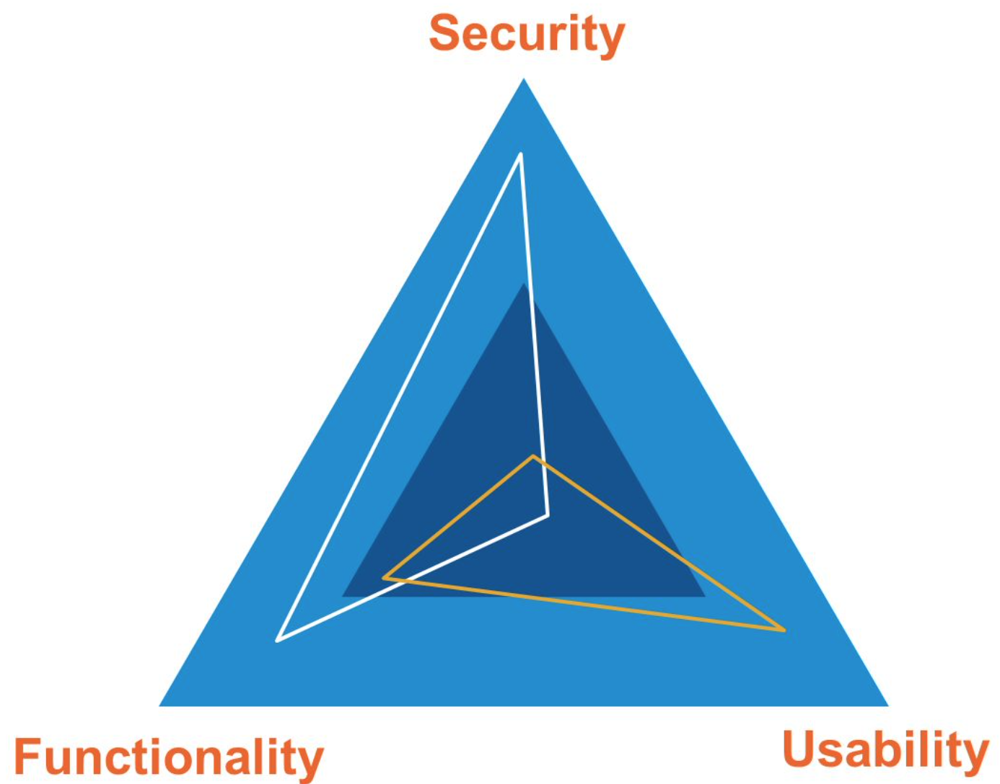

# Introduction to Ethical Hacking

Information security is the methods and processes to protect information and information systems from unauthorised access, the disclosure of information, usage or modification. Information security ensures the confidentiality, integrity and availability.

Some of the concepts associated with information security that can help readers better understand this series of articles are:

* **Data breach**: Companies posses multiple sensitive information that must be stored and protected. Information like:

    * Customers' names
    * Passwords
    * Email addresses
    * Postal addresses
    * Contact numbers
    * Date of births

In general, any personal or sensitive information belonging to customers or employees in susceptible of been gathered by hackers after an intrusion and leaked. This leak is called _data breach_.

* **Hack value**: This value describes the target's level of attraction for an attacker.

* **Zero-day attack**: Vulnerabilities that have not disclosed yet and can be exploited even before developers identify, address and release any patch.

* **Vulnerability**: The term vulnerability refers to a weak point, loophole or any entry point to a system or network which can be helpful and utilised by attackers to intrude a target.

* **Daisy-chaining**: It is the consecutive execution of attacks using the same information or the information acquired in the  previous attempt to gain access to a network or system.

* **Exploit**: An exploit is a piece of software, a chunk of data, or a sequence of commands that takes advantage of a bug or vulnerability to cause unintended or unanticipated behaviour to occur on computer software, hardware, or something electronic.

* **Doxing**: The term doxing refers to the publication of information associated with an individual.

* **Payload**: The payload is the part of the private user text which could also contain malware such as worms or viruses which performs the malicious action; deleting data, sending spam or encrypting data.

* **Bot**: A bot is a type of software application or script that performs automated tasks on command. Bad bots perform malicious tasks that allow attackers to remotely take control over an affected computer. Once infected, these machines may also be referred to as zombies.

## Elements of Information Security

The CIA Triad is a well-known, venerable model for the development of security policies used in identifying problem areas, along with necessary solutions in the arena of information security. The CIA Triad brings us the terms: Confidentiality, Integrity and Availability.

Together, these three principles form the cornerstone of any organization's security infrastructure; in fact, they should function as goals and objectives for every security program. The CIA Triad is so foundational to information security that anytime data is leaked, a system is attacked, a user takes a phishing bait, an account is hijacked, a website is maliciously taken down, or any number of other security incidents occur, you can be certain that one or more of these principles have been violated.

### Confidentiality

Confidentiality refers to an organization’s efforts to keep their data private or secret. In practice, it is about controlling access to data to prevent unauthorized disclosure. Typically, this involves ensuring that only those who are authorized have access to specific assets and that those who are unauthorized are actively prevented from obtaining access. In addition, some extra controls within a group of authorized users, there may be additional, more stringent limitations on precisely which information those authorized users are allowed to access.

### Integrity

Integrity refers to the quality of something being whole or complete. In InfoSec, integrity is about ensuring that data has not been tampered with and, therefore, can be trusted. It is correct, authentic, and reliable. Ensuring integrity involves protecting data in use, in transit and when it is stored no matter where.

### Availability

Systems, applications, networks and data are of little value to an organization and its customers if they are not accessible when authorized users need them. In a simple way, availability means that networks, systems and applications are up and running. It ensures that authorized users have timely, reliable access to resources when they are needed.

| CIA | Risk | Control |
|:-:|:-:|:-:|
| Confidentiality | Loss of privacy. Unauthorised access to information. Identity theft | Encryption. Authentication. Access control |
| Integrity | Information is no longer reliable or accurate. Fraud | Maker/Checker. Quality assurance. Audit logs |
| Availability | Business disruption. Loss of customer's confidence. Loss of revenue | Business continuity plans and tests. Backups. Sufficient capacity |

## Authenticity and Non-Repudiation

### Authenticity

Authenticity refers to the characteristic of communications, documents or data to ensure the genuineness or not corruption from an original. Major roles of authentication include confirming that the users are whom they claim to be and ensuring the message is authentic and not altered or forged.

### Non-Repudiation

Non-repudiation refers to the ability to ensure that a party to a contract or a communication cannot deny the authenticity of their signature on documents or messages they originated. It is a way to guarantee that the sender of a message cannot later deny having sent the message and that the recipient cannot deny having received the message. Digital signatures and encryption are used to establish authenticity and non-repudiation of a document or message.

## Security, Functionality and Usability Triangle

When designing applications, systems or devices, terms like security, functionality and usability need to be considered. Unfortunately, there is an inter dependency between these three attributes. When security goes up, usability and functionality come down and, the same happens with any other approach. Any organization should balance between these three qualities to arrive at a balanced information system.

A triangle can be used to help explain the relationship between the concepts of security, functionality and usability. The use of a triangle is because an increase or decrease in any one of the factors will have an impact on the presence of the other two.

* **Functionality**: It can be defined as the purpose that something is designed or expected to fulfil.

* **Usability**: It can be defined as the degree to which something is able or fit to be used.

* **Security**: It can be defined as referring to all the measures that are taken to protect a system, application or a device as well as ensuring that only people with permission to access them are able to.

## Penetration Testing Phases

We can find five different phases in a pentest. Each one with its boundaries, objectives and goals well defined. These five phases are:

### Reconnaissance

Reconnaissance refers to the preparatory phase where an attacker seeks to gather information about a target prior to launching the attack. In other words, find all the information at our fingertips. The attackers are going to use all the public sources that they can reach to find information about the target. And we are not talking just about the company, we are talking about employees, business, operations, network, system, competitors, etc. Everything we can learn about our target. We can use web pages, social networks, social engineering, etc. The objective is to know as much as we can about the victim and the elements around it.

We can find two types of reconnaissance:

* **Passive**: Involves acquiring information without directly interact with the target.
* **Active**: Involves interacting with the target directly by any means.

### Scanning

Scanning refers to a pre-attack phase where the attacker scans the network for specific information on the basis of information gathered during the reconnaissance. In general, in this step, we are going to use port scanners, vulnerability scanners and similar tools to obtain information about the target environment like live machines, ports in each one of these machines, services running, OS details, etc. All this information will allow us to launch the attack.

### Gaining access

Gaining access refers to the point where the attacker obtains access to a machine or application inside the target’s network. Part of this phase is when the attacker tries to escalate privileges to obtain complete control of the system or, based on the access the attacker has, it tries to compromise other systems in the network. Here we have multiple tools and different possibilities like password cracking, denial of service, buffer overflows, session hijacking,etc.

### Maintaining access

Maintaining access refers to the phase where the attacker tries to retain the ownership of the system and make future accesses to the compromised system easier, specially in the case that  the way the attacker has used to compromise the system is fixed. The attacker can do multiple things like create users in the system, install their own applications and hide them, install backdoors, rootkits or trojans even, in some cases, the attacker can secure the compromised machine to avoid other attackers to control the machine.

### Clearing tracks

Clearing tracks refers to the activities carried out by an attacker to hide malicious acts. In this phase, the attacker tries to remove all the pieces of evidence about the machine being compromised trying to avoid, in the first place, the detection and, in second place, obstructing the prosecution.

## Information Assurance

Information assurance (IA) combine components to assure that information and information systems are secured. Components like _Integrity_, _Availability_, _Confidentiality_ and _Authenticity_ already described.

In addition to these components, there are some methods and processes that can help to achieve information assurance such as:

* Policies and processes
* Network and  authentication
* Scanning for network vulnerabilities
* Identifying resources and possible problems
* Implementation of plans for identified requirements
* Application of information assurance controls

## Threat Modeling

Threat modelling is a core element of the Security Development Lifecycle (SDL). It is an engineering technique you can use to help you identify threats, attacks, vulnerabilities, and countermeasures that could affect your application. Threat modelling can be used to shape application designs and meet organisation security objectives allowing them to reduce risks.

There are five major threat modelling steps:

* Defining security requirements.
* Application overview.
* Identifying threats.
* Mitigating threats.
* Validating that threats have been mitigated.

## Enterprise Information Security Architecture

Enterprise Information Security Architectures (EISAs) are fundamental concepts or properties of a system in its environment embodied in its elements, relationship, and in the principles of its design and evolution. They are fundamental concepts and properties of a system that establish the purpose, context, and principles that provide useful guidance for IT staff to help make secure design decisions. EISAs also define the environment and relationships that it exists in, while also doing some deep digging into the concepts and imagination of a system.

An EISA should be defined by business objectives and support the business needs in a flexible way that allows your organization to staff at the level that you require. It should also be utilized as a layered IT defence plan that analyzes the risks and threats to your portfolio, laying out practical standards for how to assess risks, rather than just technical ones.  Maintaining a focused EISA strategy is ultimately what will help your organization understand how internal and external forces can and will affect your bottom line in the short and long-term.

| Dimension |  |
|:-|:-|
| Business | Represents the information security organization and process dimensions. This viewpoint reflects the “business of security,” in the sense that it represents the way information security is practised in the organization, as well as how the “security business” interrelates with the rest of the enterprise via processes, roles, responsibilities and organizational structures.  |
| Informational | Represents the information required to run the information security function. It represents the information models used by the security team, as well as the models used to capture the security requirements for enterprise information. |
| Technical | Represents the security infrastructure architectures. It captures the models that are used to abstract varying requirements for security into guidance for required hardware and software configurations. |

## Network Security Zoning

Zoning is used to mitigate the risk of an open network by segmenting infrastructure services into logical groupings that have the same communication security policies and security requirements. The zones are separated by perimeters (Zone Interface Points) implemented through security and network devices.

Zoning is a logical design approach used to control and restrict access and data communication flows only to those components and users as per security policy. A new zone is defined by a logical grouping of services under the same policy constraints, driven by business requirements. When a new set of policy constraints are established, then a new zone is required.

Basic security zones defined are:

### Public Zone

The public zone is entirely open and includes public networks such as the public Internet, the public switched telephone network, and other public carrier backbone networks and services. Restrictions and requirements are difficult or impossible to place or enforce on this zone because it is normally outside the control of the GC. The public zone environment is assumed extremely hostile.

### Public Access Zone

A PAZ mediates access between operational GC systems and the public zone. The interfaces to all government on-line services should be implemented in a PAZ. Proxy services that allow GC personnel to access Internet-based applications should be implemented in a PAZ, as should external e-mail, remote access, and extranet gateways. [Reference 4]

A demilitarized zone (DMZ) is a component within a PAZ.

### Operation Zone

An OZ is the standard environment for routine GC operations and is where most end-user systems and workgroup servers are installed. With appropriate security controls at the end-systems, this zone may be suitable for processing sensitive information; however, it is generally unsuitable for large repositories of sensitive data or critical applications without additional strong, trustworthy security controls that are beyond the scope of this guideline.

### Restricted Zone

An RZ provides a controlled network environment generally suitable for business-critical IT services (that is, those having medium reliability requirements, where compromise of the IT services would cause a business disruption) or large repositories of sensitive information (for example, a data centre). It supports access from systems in the public zone via a PAZ.

## Information Security Policies

An information security policy (ISP) is a set of rules that guide individuals who work with IT assets. Your company can create an information security policy to ensure your employees and other users follow security protocols and procedures. An updated and current security policy ensures that sensitive information can only be accessed by authorized users.

Creating an effective security policy and taking steps to ensure compliance is a critical step to prevent and mitigate security breaches. To make your security policy truly effective, update it in response to changes in your company, new threats, conclusions drawn from previous breaches, and other changes to your security posture.

The basic goals and objectives of information security policies are:

* Cover security requirement and conditions of the organisation.
* Protect organisations resources.
* Eliminate legal liabilities.
* Minimise the wastage of resources.
* Prevent against unauthorised access/modification, etc.
* Minimise the risk.
* Information assurance.

There are some steps to define information security policies:

1. Risk assessment: Identify possible risks.
2. Guidelines: Learn standards.
3. Management: Discussions with management and related staff.
4. Penalties: Set penalties.
5. Finalisation: Ready final version.
6. Agreement: Ensure everyone is agreed and understood.
7. Enforcement: Deploy the policy.
8. Training: Train the employees.
9. Review/Update: Regular reviews and updated when needed.

### Types of Security Policies

* **Promiscuous policy**: This policy does not impose any restrictions on the usage of system resources.

* **Permissive Policy**: Policy begins wide-open and only the known dangerous services/attacks or behaviours are blocked.

* **Prudent Policy**: A prudent policy starts with all the services blocked. The administrator permits safe and necessary services singly. It logs everything, like system and network activities. It provides most security whereas permitting only proverbial however necessary dangers.

* **Paranoid Policy**: A paranoid policy forbids everything. There is a strict restriction on all use of company computers, whether or not it is system usage or network usage. There is either no net association or severely restricted net usage. Because of these to a fault severe restrictions, users typically try and notice ways that around them.

## Physical Security

## Types of Attackers

There are different types of attackers. The list of types of attackers can be very large but similar general classifications can be found. One of these classifications is:

* **Black hats**: Individuals with extraordinary computing skills, resorting to malicious or destructive activities where they don’t have permissions or authorization to be on the network or to do what they are doing. Typically, they are known as crackers.

* **White hats**: Individuals professing hacker skills and using them for defensive purposes, they have permission to do things that they are supposed to be doing and they are also known as security analysts.

* **Gray hats**: Individuals who work both offensively and defensively at various times, usually they are driven by their own believes and thought. Some times they can be acting as black hackers, sometimes as white hackers.

* **Suicide hackers**: Individuals who aim to bring down critical infrastructures for a _cause_ and are not worried about facing jail terms or any other kind of punishment.

* **Script kiddies**: An unskilled hacker who compromises systems by running scripts, tools and software developed by real hackers without the knowledge to understand what are they doing and why.

* **Cyber terrorists**: Individuals with a wide range of skills, motivated by religious or political beliefs to create fear by large-scale disruption of computer networks.

* **State-sponsored hackers**: Individuals employed by the government to penetrate and gain top-secret information and to damage information systems of other governments.

* **Hacktivist**: Individuals who promote a political agenda by hacking, especially by defacing or disabling websites.