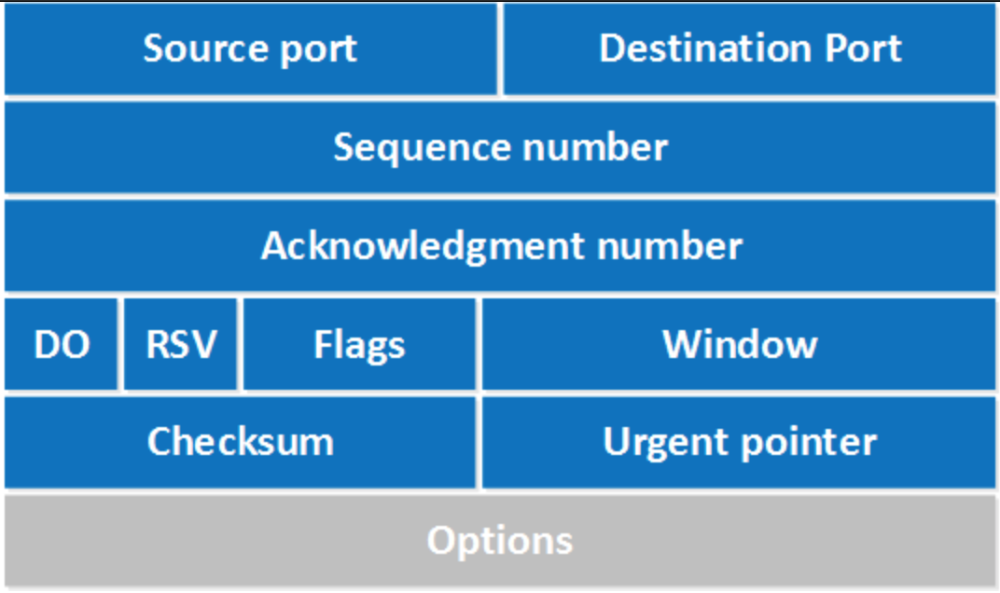
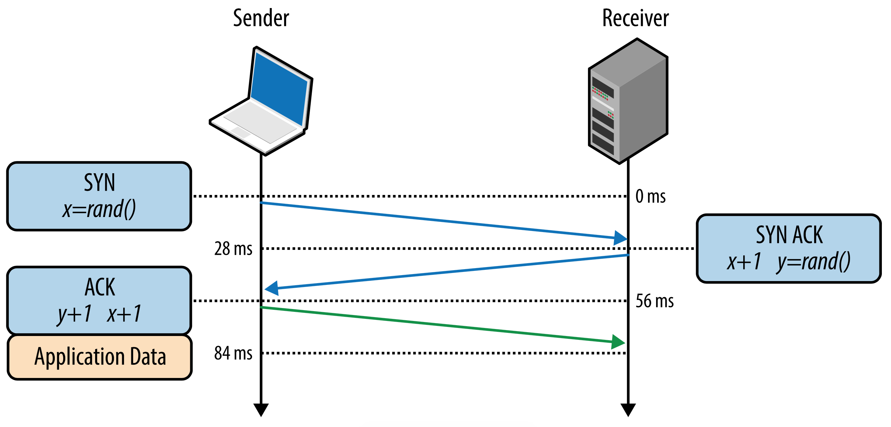
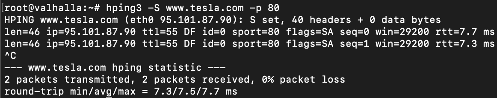
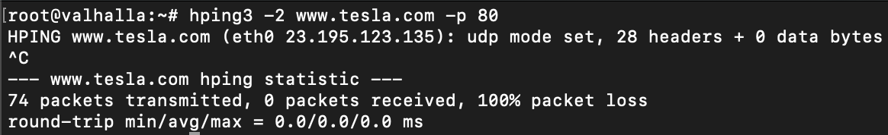
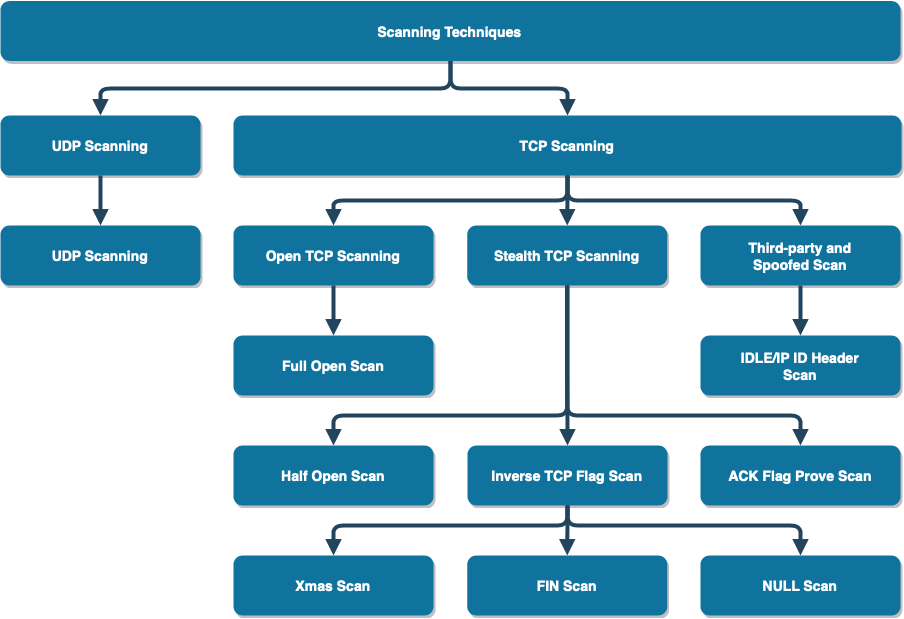

# 3. Scanning Networks

At this point, attackers have collected enough information about the target to take the next step, network scanning. In this phase, attackers will try to obtain concrete network information about the target resources. Things like:

* Identify live hosts.
* Identify open and closed ports.
* Identify operating system information.
* Identity services running on a network.
* Identity running processes.
* Identify existing security devices.
* Identify system architecture.
* Identify running services.
* Identify vulnerabilities.

During this phase attackers will start to establish contact with the target resources and extract information from the responses, trying to gain more knowledge of the network architecture and possible attack vectors.

## Network theory

The [Internet Protocol](https://en.wikipedia.org/wiki/Internet_Protocol) (IP) is the principal communications protocol in the Internet protocol suite for relaying datagrams across network boundaries. Its routing function enables internetworking and essentially establishes the Internet.

IP has the task of delivering packets from the source host to the destination host solely based on the IP addresses in the packet headers. For this purpose, IP defines packet structures that encapsulate the data to be delivered. It also defines addressing methods that are used to label the datagram with source and destination information.

Two types of IP traffic can be found:

* TCP
* UDP

### TCP

The [Transmission Control Protocol](https://en.wikipedia.org/wiki/Transmission_Control_Protocol) (TCP) is one of the main protocols of the Internet protocol suite. It originated in the initial network implementation in which it complemented the Internet Protocol (IP). Therefore, the entire suite is commonly referred to as TCP/IP. TCP provides reliable, ordered, and error-checked delivery of a stream of octets (bytes) between applications running on hosts communicating via an IP network. Major internet applications such as the World Wide Web, email, remote administration, and file transfer rely on TCP, which is part of the Transport Layer of the TCP/IP suite.

TCP is connection-oriented, and a connection between client and server is established (passive open) before data can be sent. Three-way handshake (active open), retransmission, and error-detection adds to reliability but lengthens latency. This handshake ensures a successful and reliable connection between to serves.

Here it is shown the format of the TCP header:

The field 'Flag' deserves a deeper analysis of the possible values that it can contain because some of the types of scanners we are going to see are closely related to them. We can find the next flag values:

| Flag | Use |
| :- | :- |
| SYN | Initiates a connection between to host to facilitate communication |
| ACK | Acknowledge the receipt of a packet |
| URG | Indicates that the data contained in the packet is urgent and should be processed immediately  |
| PSH | Instructs the sending system to send all buffered data immediately |
| FIN | Tells de remote system about the end of the communication, close the connection gracefully |
| RST | Reset a connection |

As named before, a TCP communication starts with a three-way handshake

There are multiple network scanners that it will allow to use and send packets containing the different flags but, it is worth to say that there are some tools it can use to craft packets in a more manual way. [Python](https://www.python.org), for example, using the [Scrapy](https://scrapy.org) library gives versatility to create them programmatically and the tool [hping3](https://tools.kali.org/information-gathering/hping3) can help with it too. This will allow attackers a more fine control when testing a firewall or doing advanced port scanning. Also, some low point of view is always instructive

We can generate some packets with the flag SYN to do some port scanning:

This test returns a SYN/ACK if the communication has been accepted or RST/ACK if the port is closed or filtered. In this case, the destination port of the packet is open.

Hping3 is a very versatile tool with multiple options.

### UDP

The [User Datagram Protocol](https://en.wikipedia.org/wiki/User_Datagram_Protocol) (UDP) is one of the core members of the Internet protocol suite. The protocol was designed by David P. Reed in 1980 and formally defined in RFC 768. With UDP, computer applications can send messages, in this case, referred to as datagrams, to other hosts on an Internet Protocol (IP) network. Prior communications are not required to set up communication channels or data paths.

UDP uses a simple connectionless communication model with a minimum of protocol mechanisms. UDP provides checksums for data integrity, and port numbers for addressing different functions at the source and destination of the datagram. It has no handshaking dialogues, and thus exposes the user's program to any unreliability of the underlying network; there is no guarantee of delivery, ordering, or duplicate protection.

In the same way, TCP packets have been generated with hping3, UDP packets can be generated with hping3:

In this case, it is not possible to reach the server because the port 80 is using the TCP protocol.

## Scanning methodology

It is good for attackers to follow some kind of methodology or system to avoid missing something on their attempts. As said before, every attacker has its methodology (even if it is chaos), the steps shown here are just a suggestion:

### Check for live systems

Discovering which host are alive in the target's network. This can be done using [ICMP](https://en.wikipedia.org/wiki/Internet_Control_Message_Protocol) packets. The attacker sends an `ICMP Echo`and the server responds with an `ICMP Echo Reply` if it is alive. The tool `ping` is an example of this.

#### ICMP scan

Technique to identify live servers using ICMP packets.

#### Ping sweep

Technique to identify live server using ICMP packets at a large scale using IP ranges.

### Discovering open ports

Once attackers have a list of live servers they can try to discover what ports are open on them.

#### SSDP scanning

The [Simple Service Discovery Protocol](https://en.wikipedia.org/wiki/Simple_Service_Discovery_Protocol) (SSDP) is a network protocol based on the Internet protocol suite for advertisement and discovery of network services and presence information. It accomplishes this without the assistance of server-based configuration mechanisms, such as Dynamic Host Configuration Protocol (DHCP) or Domain Name System (DNS), and without special static configuration of a network host. SSDP is the basis of the discovery protocol of Universal Plug and Play (UPnP) and is intended for use in residential or small office environments.

#### Scanning tools

Port scan tools are widely spread. They give us multiple information about a live host and its ports.

##### Nmap

Without questions, the most well know is [Nmap](https://nmap.org). Nowadays, it is not just a port scanner, it can perform some other things but, here, the only interest is its scanning capabilities. Nmap can discover live hosts, open ports, services version and operative systems among other things.

##### hping2 and hping3

hping3 has been already named but, it has not been listed the things that can be done with it and its great capabilities to handcraft packets. Things like:

* Test firewall rules
* Advanced port scanning
* Testing network performance
* Path MTU discovery
* Transfering rules between complex firewall rules
* Traceroute-like under different protocols
* Remote fingerprinting and others

#### Scanning techniques

There is a variety of different scanning techniques that attackers can use to gather the desired information:

##### Full Open Scan

In this type of scanner the three-way handshake is initiated and completed. It is easy to detect and log by security devices. Does not require superuser privileges.

##### Half Open Scan

Also know as stealth scan, 

### Scanning beyond IDS

### Banner grabbing

### Scanning vulnerabilities

### Network diagram

### Proxies