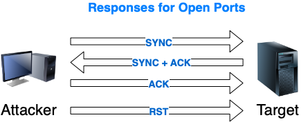
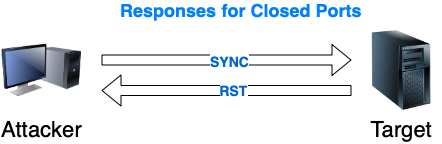
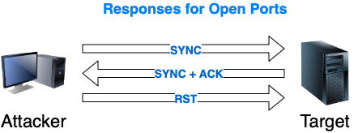
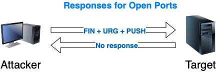
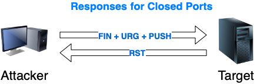
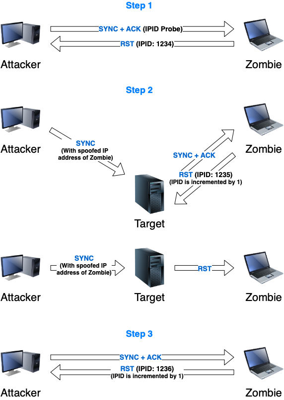

# 3. Scanning Networks

At this point, attackers have collected enough information about the target to take the next step, network scanning. In this phase, attackers will try to obtain concrete network information about the target resources. Things like:

* Identify live hosts.
* Identify open and closed ports.
* Identify operating system information.
* Identity services running on a network.
* Identity running processes.
* Identify existing security devices.
* Identify system architecture.
* Identify running services.
* Identify vulnerabilities.

During this phase attackers will start to establish contact with the target resources and extract information from the responses, trying to gain more knowledge of the network architecture and possible attack vectors.

## Network theory

The [Internet Protocol](https://en.wikipedia.org/wiki/Internet_Protocol) (IP) is the principal communications protocol in the Internet protocol suite for relaying datagrams across network boundaries. Its routing function enables internetworking and essentially establishes the Internet.

IP has the task of delivering packets from the source host to the destination host solely based on the IP addresses in the packet headers. For this purpose, IP defines packet structures that encapsulate the data to be delivered. It also defines addressing methods that are used to label the datagram with source and destination information.

Two types of IP traffic can be found:

* TCP
* UDP

### TCP

The [Transmission Control Protocol](https://en.wikipedia.org/wiki/Transmission_Control_Protocol) (TCP) is one of the main protocols of the Internet protocol suite. It originated in the initial network implementation in which it complemented the Internet Protocol (IP). Therefore, the entire suite is commonly referred to as TCP/IP. TCP provides reliable, ordered, and error-checked delivery of a stream of octets (bytes) between applications running on hosts communicating via an IP network. Major internet applications such as the World Wide Web, email, remote administration, and file transfer rely on TCP, which is part of the Transport Layer of the TCP/IP suite.

TCP is connection-oriented, and a connection between client and server is established (passive open) before data can be sent. Three-way handshake (active open), retransmission, and error-detection adds to reliability but lengthens latency. This handshake ensures a successful and reliable connection between to serves.

Here it is shown the format of the TCP header:

The field 'Flag' deserves a deeper analysis of the possible values that it can contain because some of the types of scanners we are going to see are closely related to them. We can find the next flag values:

| Flag | Use |
| :- | :- |
| SYN | Initiates a connection between to host to facilitate communication |
| ACK | Acknowledge the receipt of a packet |
| URG | Indicates that the data contained in the packet is urgent and should be processed immediately  |
| PSH | Instructs the sending system to send all buffered data immediately |
| FIN | Tells de remote system about the end of the communication, close the connection gracefully |
| RST | Reset a connection |

As named before, a TCP communication starts with a three-way handshake

There are multiple network scanners that it will allow to use and send packets containing the different flags but, it is worth to say that there are some tools that can be used to handcraft packets. [Python](https://www.python.org), for example, using the [Scrapy](https://scrapy.org) library gives versatility to create them programmatically and the tool [hping3](https://tools.kali.org/information-gathering/hping3) can help with it too. This will allow attackers a more fine control when testing a firewall or doing advanced port scanning. Also, some low point of view is always instructive

We can generate some packets with the flag SYN to do some port scanning:

This test returns SYN/ACK if the communication has been accepted or RST/ACK if the port is closed or filtered. In this case, the destination port of the packet is open.

Hping3 is a very versatile tool with multiple options.

### UDP

The [User Datagram Protocol](https://en.wikipedia.org/wiki/User_Datagram_Protocol) (UDP) is one of the core members of the Internet protocol suite. The protocol was designed by David P. Reed in 1980 and formally defined in RFC 768. With UDP, computer applications can send messages, in this case, referred to as datagrams, to other hosts on an Internet Protocol (IP) network. Prior communications are not required to set up communication channels or data paths.

UDP uses a simple connectionless communication model with a minimum of protocol mechanisms. UDP provides checksums for data integrity, and port numbers for addressing different functions at the source and destination of the datagram. It has no handshaking dialogues, and thus exposes the user's program to any unreliability of the underlying network; there is no guarantee of delivery, ordering, or duplicate protection.

In the same way, TCP packets have been generated with hping3, UDP packets can be generated with hping3:

In this case, it is not possible to reach the server because its port 80 is using the TCP protocol.

## Scanning methodology

It is good for attackers to follow some kind of methodology or system to avoid missing something on their attempts. As said before, every attacker has its methodology (even if it is chaos), the steps shown here are just a suggestion:

### Check for live systems

Discovering which host is alive in the target's network. This can be done using [ICMP](https://en.wikipedia.org/wiki/Internet_Control_Message_Protocol) packets. The attacker sends an `ICMP Echo`and the server responds with an `ICMP Echo Reply` if it is alive. The tool `ping` is an example of this.

#### ICMP scan

The technique to identify live servers using ICMP packets.

#### Ping sweep

The technique to identify live server using ICMP packets at a large scale using IP ranges.

### Discovering open ports

Once attackers have a list of live servers they can try to discover what ports are open on them.

#### SSDP scanning

The [Simple Service Discovery Protocol](https://en.wikipedia.org/wiki/Simple_Service_Discovery_Protocol) (SSDP) is a network protocol based on the Internet protocol suite for advertisement and discovery of network services and presence information. It accomplishes this without the assistance of server-based configuration mechanisms, such as Dynamic Host Configuration Protocol (DHCP) or Domain Name System (DNS), and without special static configuration of a network host. SSDP is the basis of the discovery protocol of Universal Plug and Play (UPnP) and is intended for use in residential or small office environments.

#### Scanning tools

Port scan tools are widely spread. They give us multiple information about a live host and its ports.

##### Nmap

Without questions, the most well know is [Nmap](https://nmap.org). Nowadays, it is not just a port scanner, it can perform some other things but, here, the only interest is its scanning capabilities. Nmap can discover live hosts, open ports, services version and operative systems among other things.

When talking about the different scanning techniques, some command will be shown referring to Nmap syntax.

##### hping2 and hping3

hping3 has been already named but, it has not been listed the things that can be done with it and its great capabilities to handcraft packets. Things like:

* Test firewall rules
* Advanced port scanning
* Testing network performance
* Path MTU discovery
* Transfering rules between complex firewall rules
* Traceroute-like under different protocols
* Remote fingerprinting and others

#### Scanning techniques

There is a variety of different scanning techniques that attackers can use to gather the desired information:

##### Full Open Scan

In this type of scanner, the three-way handshake is initiated and completed. It is easy to detect and log by security devices. Does not require superuser privileges.

To perform this type of scan with Nmap, the next command can be executed:

`nmap -sT <ip_address or range>`

##### Stealth Scan - Half Open Scan

Half Open Scan is also known as stealth scan. This type of scan starts the three-way handshake but, once it has received an initial response that allows deciding if a port is open or closed, interrupts the handshake, making the scan more difficult to detect.

To perform this type of scan with Nmap, the next command can be executed:

`nmap -sS <ip_address or range>`

##### Inverse TCP Flag Scan

Inverse TCP flag scanning works by sending TCP probe packets with or without TCP flags. Based on the response, it is possible to determine whether the port is open or closed. If there is no response, then the port is open. If the response is RST, then the port is closed.

Probes with flags scan are known as Xmas scans. Probes without flags are known as Null scans.

##### Xmas Scan

Xmas scan works by sending a TCP frame with FIN, URG, and PUSH flags set to the target device. Based on the response, it is possible to determine whether the port is open or closed. If there is no response, then the port is open. If the response is RST, then the port is closed. It is important to note that this scan works only for UNIX hosts.

To perform this type of scan with Nmap, the next command can be executed:

`nmap -sX <ip_address or range>`

##### Null Scan

A Null Scan works sending a TCP packet that contains a sequence number of 0 and no flags set. Because the Null Scan does not contain any set flags, it can sometimes penetrate firewalls and edge routers that filter incoming packets with particular flags.

The expected result of a Null Scan on an open port is no response. Since there are no flags set, the target will not know how to handle the request. It will discard the packet and no reply will be sent. If the port is closed, the target will send an RST packet in response.

To perform this type of scan with Nmap, the next command can be executed:

`nmap -sN <ip_address or range>`

##### FIN Scan

A FIN scan works sending a packet only with the flag FIN. Packets can bypass firewalls without modification. Closed ports reply to a FIN packet with the appropriate RST packet, whereas open ports ignore the packet on hand. This is typical behaviour due to the nature of TCP and is, in some ways, an inescapable downfall.

To perform this type of scan with Nmap, the next command can be executed:

`nmap -SF <ip_address or range>`

##### ACK Flag Probe Scan

ACK flag probe scanning works by sending TCP probe packets with ACK flag set to determine whether the port is open or closed. This is done by analyzing the TTL and WINDOW field of the received RST packet's header. The port is open if the TTL value is less than 64.

Similarly, the port is also considered to be open if the WINDOW value is not 0 (zero). Otherwise, the port is considered to be closed.

ACK flag probe is also used to determine the filtering rules of the target network. If there is no response, then that means that a stateful firewall is present. If the response is RST, then the port is not filtered.

##### IDLE/IPID Header Scan

IDLE/IPID header scan works by sending a spoofed source address to the target to determine which services are available. In this scan, attackers use IP address of a zombie machine for sending out the packets. Based on the IPID of the packer (fragment identification number), it is possible to determine whether the port is open or closed.

Idle scans take advantage of predictable Identification field value from IP header: every IP packet from a given source has an ID that uniquely identifies fragments of an original IP datagram; the protocol implementation assigns values to this mandatory field generally by a fixed value increment. Because transmitted packets are numbered in a sequence you can say how many packets are transmitted between two packets that you receive.

An attacker would first scan for a host with a sequential and predictable sequence number (IPID). The latest versions of Linux, Solaris, OpenBSD, and Windows Vista are not suitable as a zombie, since the IPID has been implemented with patches that randomized the IPID. Computers chosen to be used in this stage are known as "zombies".

Once a suitable zombie is found the next step would be to try to establish a TCP connection with a given service (port) of the target system, impersonating the zombie. It is done by sending a SYN packet to the target computer, spoofing the IP address from the zombie, i.e. with the source address equal to a zombie IP address.

If the port of the target computer is open it will accept the connection for the service, responding with a SYN/ACK packet back to the zombie.

The zombie computer will then send a RST packet to the target computer (to reset the connection) because it did not send the SYN packet in the first place.

Since the zombie had to send the RST packet it will increment its IPID. This is how an attacker would find out if the targets port is open. The attacker will send another packet to the zombie. If the IPID is incremented only by a step then the attacker would know that the particular port is closed.

The method assumes that zombie has no other interactions: if there is any message sent for other reasons between the first interaction of the attacker with the zombie and the second interaction other than RST message, there will be a false positive.

##### UDP Scan

UDP scanning uses the UDP protocol to test whether the port is open or closed. In this scan, there is no flag manipulation. Instead, ICMP is used to determine if the port is open or not. So, if a packet is sent to a port and the ICMP port unreachable packet is returned, then that means that the port is closed. If, however, there is no response, then the port is open.

 To perform this type of scan with Nmap, the next command can be executed:

`nmap -sU -v <ip_address or range>`

### Scanning beyond IDS

### Banner grabbing

### Scanning vulnerabilities

### Network diagram

### Proxies