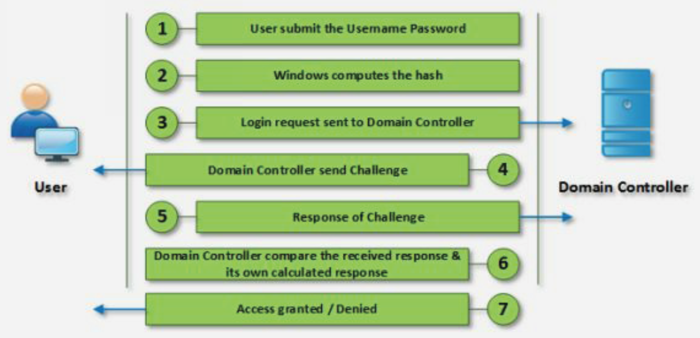

# System Hacking

At this point, attackers have gathered enough information, or should have gathered enough information, to try to compromise the target systems.

This is, without questions, the most difficult phase of an attack or a pentest. In both cases, it is needed patience, tenacity and perseverance. Failures are going to happen, theories are going to be proven wrong, mistakes are going to be made and disappointments are going to happen. After all of this, maybe, attackers or security professionals will get some results. But, as Thomas Edison said, _"I did not fail. I just found 2,000 ways not to make a lightbulb; I only needed to find one way to make it work."_. Attackers do not fail, they just need to find one way to compromise the system to achieve their objective.

Compromising a system is not a matter of, if it will be or not, it is just about the time and resources necessary to compromise it. Security professionals try to increase the time needed as much as possible and attackers reduce it as much as they can. A system will never be completely secure but, if it is secure enough, the time and resources that need to be invested will not be worth it. Still, there will be attempts just for fun, curiosity or as a challenge but, the ratio of potentially serious attacks will be lower.

Compromise a system is a very broad term. The intentions of an attacker when compromising a system are:

* Gain access
* Privileges escalation
* Maintain remote access
* Steal information, data or any other type of asset
* Clean and hiding pieces of evidence of the attack

There are multiple system hacking methodologies that, at least, include the next steps and match the concept of compromise a system:

1. Cracking passwords
2. Escalating privileges
3. Executing applications
4. Hiden files
5. Covering tracks

## Password Cracking

It is said that a secure system should base its strengthness on three factors:

* Something the user knows, like credentials i.e. username and password.
* Something the user is, like biometrics.
* Something the user has, like a security card or a token generator.

The implementation of the three mechanisms is, maybe, a not simple approach and only very secure systems use it. And, nowadays, there is a tendency on the use of second-factor authentication, usually based on something the user knows and something the user has. This is an excellent tendency that it should be mainstream. But, the unfortunate reality is that a lot of systems are just protected by a pair os username and password.

If attackers have been diligent enough, at this point, they will have a list of enumerated usernames to try in the target systems. At this point, it is where password cracking plays an important part. Guessable passwords, short passwords, passwords with weak encryption, simple passwords with only letters and or numbers make easy for attackers to crack them.

The best defence against these cracking password techniques is to have a strong lengthy and difficult password to guess. Typically, a good password contains:

* Case sensitive letters
* Special characters
* Numbers
* At least, 8 characters length if not more

### Types of Password Attacks

#### Non-Electronic Attacks

Attackers do not need any technical knowledge or tool to perform this attack. Things like:

* Shoulder Surfing
* Social Engineering
* Dumpster Diving

#### Active Online Attacks

Attackers perform password cracking by directly communicating with the victim machine.

* **Dictionary attack**: The dictionary attack, as its name suggests, is a method that uses an index of words that feature most commonly as user passwords. This is a slightly less-sophisticated version of the brute force attack but it still relies on hackers bombarding a system with guesses until something sticks.

* **Brute force attack**: Similar in function to the dictionary attack, the brute force attack is regarded as being a little more sophisticated. Rather than using a list of words, brute force attacks are able to detect non-dictionary terms, such as alpha-numeric combinations. This means passwords that include strings such as "aaa1" or "zzz10" could be at risk from a brute force attack.

* **Hash Injection**: A pass the hash attack is an exploit in which an attacker steals a hashed user credential and, without cracking it, reuses it to trick an authentication system into creating a new authenticated session on the same network.

* **Phishing**: There is an easy way to hack: ask the user for his or her password. A phishing email leads the unsuspecting reader to a faked log in page associated with whatever service it is the hacker wants to access, requesting the user to put right some terrible problem with their security. That page then skims their password and the hacker can go use it for their own purpose.

* **Malware**: A keylogger, or screen scraper, can be installed by malware which records everything users type or takes screenshots during a login process, and then forwards a copy of this file to hacker central.

* **Password Guessing**: The password crackers best friend, of course, is the predictability of the user. Unless a truly random password has been created using software dedicated to the task, a user-generated random' password is unlikely to be anything of the sort. Instead, thanks to our brains' emotional attachment to things we like, the chances are those random passwords are based upon our interests, hobbies, pets, family and so on. In fact, passwords tend to be based on all the things we like to chat about on social networks and even include in our profiles.

#### Passive Online Attacks

Attackers perform password cracking without communicating with the authorizing party.

* **Wire Sniffing**: Sniffing attack or a sniffer attack, in context of network security, corresponds to theft or interception of data by capturing the network traffic using a sniffer (an application aimed at capturing network packets). When data is transmitted across networks, if the data packets are not encrypted, the data within the network packet can be read using a sniffer. Using a sniffer application, an attacker can analyze the network and gain information to eventually cause the network to crash or to become corrupted, or read the communications happening across the network.

* **Man-in-the-Middle**: A man-in-the-middle attack (MITM) is an attack where the attacker secretly relays and possibly alters the communications between two parties who believe that they are directly communicating with each other. The attacker must be able to intercept all relevant messages passing between the two victims and inject new ones. This is straightforward in many circumstances; for example, an attacker within the reception range of an unencrypted wireless access point (Wi-Fi) could insert themselves as a man-in-the-middle.

* **Replay Attack**: A replay attack (also known as playback attack) is a form of network attack in which valid data transmission is maliciously or fraudulently repeated or delayed. This is carried out either by the originator or by an adversary who intercepts the data and re-transmits it, possibly as part of a masquerade attack by IP packet substitution. This is one of the lower-tier versions of a _Man-in-the-middle attack_.

#### Default Password

As mentioned before, a default password is supplied by the manufacturer with new equipment (e.i. switches, hubs, routers) that is password protected. Attackers can easily find lists with compilations of these passwords and use them to access a system.

#### Offline Attack

Attacker copies the target's password file and then tries to crack passwords in his own system at a different location.

* **Pre-Computed Hashes and Rainbow Tables**: Rainbow tables might sound innocuous, but they are in fact incredibly useful tools in a hacker's arsenal. When passwords are stored on a computer system, they are hashed using encryption - the 1-way nature of this process means that it is impossible to see what the password is without the associated hash. Simply put, rainbow tables function as a pre-computed database of passwords and their corresponding hash values. This will then be used as an index to cross-reference hashes found on a computer with those already pre-computed in the rainbow table. Compared to a brute force attack, which does a lot of the computation during the operation, rainbow tables boil the attack down to just a search through a table.

* **Distributed Network**: A Distributed Network Attack (DNA) technique is used for recovering passwords from hashes or password-protected files using the unused processing power of machines across the network to decrypt passwords. The DNA Manager is installed in a central location where machines running on DNA Client can access it over the network. DNA Manager coordinates the attack and allocates small portions of the key search to machines that are distributed over the network. DNA Client runs in the background, consuming only unused processor time. The program combines the processing capabilities of all the clients connected to the network and uses it to crack the password.

#### USB Drive

For this attack, the attacker needs physical access to the target machine. The attacker will insert a USB drive previously prepared with a password cracker tool and an autorun mechanism on the targeted computer. Once the device is connected the tool will try to crack the password.

### Authentication mechanisms

In computer environments, authentication is the verification process to identify a user or device to probe it has legitimate access right to resources. This avoids impostors making use of or accessing resources they should not be allowed ensuring the authentication of users, computers and services.

Microsoft platform implements multiple authentication protocols, among them we can find:

* Kerberos
* Security Account Manager (SAM)
* NT LAN Manager (NTLM)

#### Kerberos

Kerberos is a network authentication protocol. It is designed to provide strong authentication for client/server applications by using secret-key cryptography. The Kerberos protocol uses strong cryptography so that a client can prove its identity to a server (and vice versa) across an insecure network connection. After a client and server have used Kerberos to prove their identity, they can also encrypt all of their communications to assure privacy and data integrity as they go about their business.

Here are the most basic steps taken to authenticate in a Kerberized environment.

1. Client requests an authentication ticket (TGT) from the Key Distribution Center (KDC).
2. The KDC verifies the credentials and sends back an encrypted TGT and session key.
3. The TGT is encrypted using the Ticket Granting Service (TGS) secret key.
4. The client stores the TGT and when it expires the local session manager will request another TGT (this process is transparent to the user).

If the Client is requesting access to a service or other resource on the network, this is the process:

5. The client sends the current TGT to the TGS with the Service Principal Name (SPN) of the resource the client wants to access.
6. The KDC verifies the TGT of the user and that the user has access to the service.
7. TGS sends a valid session key for the service to the client.
8. Client forwards the session key to the service to prove the user has access, and the service grants access.

#### Security Account Manager (SAM)

Windows stores and manages the local user and group accounts in a database file called SecurityAccount Manager (SAM). It authenticates local user logons. On a domain controller, it simply stores the administrator account from the time it was a server, which serves as the Directory Services Restore Mode (DSRM) recovery account.

In the SAM, each user account can be assigned a local area network (LAN) password and a Windows password. Both are encrypted. If someone attempts to log on to the system and the user name and associated passwords match an entry in the SAM, a sequence of events takes place ultimately allowing that person access to the system. If the user name or passwords do not properly match any entry in the SAM, an error message is returned requesting that the information be entered again.

In personal computers (PCs) not connected into a LAN and for which there is only one user, Windows asks for only one password when the system is booted up. This function can be disabled if the user does not want to enter authentication data every time the computer is switched on or restarted. The main purpose of the SAM in a PC environment is to make it difficult for a thief to access the data on a stolen machine. It can also provide some measure of security against online hackers.

The user passwords are stored in a hashed format in a registry hive either as an LM hash or as an NTLM hash. Windows XP or later versions do not store the value of LM hash or, if it exceeds fourteen characters, it stores blank or a dummy value instead. This file can be found in `%SystemRoot%/system32/config/SAM` and is mounted on `HKLM/SAM`. This information is stored following the next format:

`username:userId:LMHash:NTLMHash:::`

#### NT LAN Manager (NTLM)

NT (New Technology) LAN Manager (NTLM) is a suite of [Microsoft security protocols](https://docs.microsoft.com/en-us/openspecs/windows_protocols/ms-nlmp/b38c36ed-2804-4868-a9ff-8dd3182128e4) intended to provide authentication, integrity, and confidentiality to users.

NTLM is a challenge-response authentication protocol which uses three messages to authenticate a client in a connection-oriented environment (connectionless is similar), and a fourth additional message if integrity is desired.

1. First, the client establishes a network path to the server and sends a `NEGOTIATE_MESSAGE` advertising its capabilities.
2. Next, the server responds with `CHALLENGE_MESSAGE` which is used to establish the identity of the client.
3. Finally, the client responds to the challenge with an `AUTHENTICATE_MESSAGE`.

The NTLM authentication process can be observed in the image below.

Before Kerberos, Microsoft used NTLM technology. The biggest difference between the two systems is the third-party verification and stronger encryption capability in Kerberos. This extra step in the process provides a significant additional layer of security over NTLM.

### Protecting Passwords

When passwords are stored they should not be stores as plain text, to avoid this, there are a few techniques that can be used:

* **Encryption**: Encryption is the practice of scrambling information in a way that only someone with a corresponding key can unscramble and read it. Encryption is a two-way function. When users encrypt something, they are doing so with the intention to decrypting it later. To encrypt data it is used an algorithm – a series of well-defined steps that can be followed procedurally – to encrypt and decrypt information.

* **Hashing**: Hashing is the practice of using an algorithm to map data of any size to a fixed length. This is called a hash value. Whereas encryption is a two-way function, hashing is a one-way function. While it is technically possible to reverse-hash something, the computing power required makes it unfeasible.

* **Salting**: Salting is a concept that typically pertains to password hashing. Essentially, it is a unique value that can be added to the end of the password to create a different hash value. This adds a layer of security to the hashing process, specifically against brute force attacks.

Despite all these techniques, hashes can be cracked or, at least, there a few techniques that can try to crack a hash.

* **Dictionary and Brute Force Attacks**: The simplest way to crack a hash is to try to guess the password, hashing each guess, and checking if the guess's hash equals the hash being cracked. If the hashes are equal, the guess is the password. The two most common ways of guessing passwords are dictionary attacks and brute-force attacks.

* **Lookup Tables**: Lookup tables are an extremely effective method for cracking many hashes of the same type very quickly. The general idea is to pre-compute the hashes of the passwords in a password dictionary and store them, and their corresponding password, in a lookup table data structure. A good implementation of a lookup table can process hundreds of hash lookups per second, even when they contain many billions of hashes.

* **Reverse Lookup Tables**: This attack allows an attacker to apply a dictionary or brute-force attack to many hashes at the same time, without having to pre-compute a lookup table. First, the attacker creates a lookup table that maps each password hash from the compromised user account database to a list of users who had that hash. The attacker then hashes each password guess and uses the lookup table to get a list of users whose password was the attacker's guess. This attack is especially effective because it is common for many users to have the same password.

* **Rainbow Tables**: Already seen it before but, rainbow tables are a time-memory trade-off technique. They are like lookup tables, except that they sacrifice hash cracking speed to make the lookup tables smaller. Because they are smaller, the solutions to more hashes can be stored in the same amount of space, making them more effective. Rainbow tables that can crack any md5 hash of a password up to 8 characters long exist.

### Password Cracking Tools

There are a plethora of password cracking tools out there. A few of them are:

* John the Ripper
* Hashcat
* THC Hydra
* Medusa
* Ophcrack

// TODO Examples

## Escalating Privileges

Privilege escalation happens when a malicious user exploits a bug, design flaw, or configuration error in an application or operating system to gain elevated access to resources that should normally be unavailable to that user. The attacker can then use the newly gained privileges to steal confidential data, run administrative commands or deploy malware – and potentially do serious damage to a target operating system, server applications, organization, and reputation.

Attackers start by exploiting a privilege escalation vulnerability in a target system or application, which lets them override the limitations of the current user account. They can then access the functionality and data of another user (horizontal privilege escalation) or obtain elevated privileges, typically of a system administrator or other power user (vertical privilege escalation). Such privilege escalation is generally just one of the steps performed in preparation for the main attack.

While usually not the main aim of an attacker, privilege escalation is frequently used in preparation for a more specific attack, allowing intruders to deploy a malicious payload or execute malicious code in the targeted system. This means that whenever users detect or suspect privilege escalation, they also need to look for signs of other malicious activity. However, even without evidence of further attacks, any privilege escalation incident is an information security issue in itself, because someone could have gained unauthorized access to personal, confidential or otherwise sensitive data. In many cases, this will have to be reported internally or to the relevant authorities to ensure compliance.

To make matters worse, it can be hard to distinguish between routine and malicious activity to detect privilege escalation incidents. This is especially true for rogue users, who might legitimately perform malicious actions that compromise security. However, if security personal can quickly detect successfully or attempted privilege escalation, they have a good chance of stopping an attack before the intruders can establish a foothold to launch their main attack.

### Horizontal Privileges Scalation

With horizontal privilege escalation, attackers remain on the same general user privilege level but can access data or functionality of other accounts or processes that should be unavailable to the current account or process. For example, this may mean using a compromised office workstation to gain access to other office users' data. For web applications, one example of horizontal privilege escalation might be getting access to another user's profile on a social site or e-commerce platform, or their bank account on an e-banking site.

### Vertical Privileges Scalation

With vertical privilege escalation (also called privilege elevation), attackers start from a less privileged account and obtain the rights of a more powerful user – typically the administrator or system user on Microsoft Windows, or root on Unix and Linux systems. With these elevated privileges, the attacker can wreak all sorts of havoc on computer systems and applications: steal access credentials and other sensitive information, download and execute malware, erase data, or execute arbitrary code. Worse still, skilled attackers can use elevated privileges to cover their tracks by deleting access logs and other evidence of their activity. This can potentially leave the victim unaware that an attack took place at all. That way, cybercriminals can covertly steal information or plant malware directly in company systems.

### When Escalation Success

Once attackers gain unauthorised access to a system and escalate privileges, now the next step of the attacker is to execute malicious applications on the target system to "own" the system. Attackers goals are:

* Installation of malware to collect information: To do this, tools like `RemoteExec` or `PDQ Deploy` can be used.
* To set up a backdoor to maintain access.
* To crack existing passwords.
* To install keyloggers for monitoring or capture user actions: I the access has been physical, it can be a hardware keylogger attached to the physical machine, otherwise, it can be a software keylogger.

### Protecting from Privilege Escalation

Attackers can use many privilege escalation techniques to achieve their goals. But to attempt privilege escalation in the first place, they usually need to gain access to a less privileged user account. Possible protection measures are:

* Enforce password policies.
* Create specialized users and groups with minimum necessary privileges and file access.
* Avoid common programming errors in applications.
* Secure databases and sanitize user input.
* Keep systems and applications patched and updated.
* Ensure correct permissions for all files and directories.
* Close unnecessary ports and remove the unused user accounts.
* Remove or tightly restrict all file transfer functionality.
* Change default credentials on all devices, including routers and printers.
* Regularly scan systems and applications for vulnerabilities.

## Spyware

Spyware is unwanted software that infiltrates computing devices, stealing internet usage data and sensitive information. Spyware is classified as a type of malware — malicious software designed to gain access to or damage computers, often without the owners' knowledge. Spyware gathers personal information and relays it to advertisers, data firms, or external users.

Spyware is used for many purposes. Usually, it aims to track and sell users internet usage data, capture credit cards or bank account information, or steal personal identities monitoring internet activity, tracking log in and password information, and spying on sensitive information.

The most common types of spyware are:

* **Adware**: This type of spyware tracks browser history and downloads, with the intent of predicting what products or services users are interested in. The adware will display advertisements for the same or related products or services to entice users to click or make a purchase. Adware is used for marketing purposes and can slow down computers.

* **System monitors**: This type of spyware can capture just about everything users do on their computers. System monitors can record all keystrokes, emails, chat-room dialogues, websites visited, and programs run. System monitors are often disguised as freeware.

* **Tracking cookies**: These track the user's web activities, such as searches, history, and downloads, for marketing purposes.

* **Trojans**: This kind of malicious software disguises itself as legitimate software. For example, Trojans may appear to be a Java or Flash Player update upon download. Trojan malware is controlled by third parties. It can be used to access sensitive information such as Social Security numbers and credit card information.

Some of the spyware features are:

* Tracking users
* Monitoring user's activity
* Record conversations
* Blocking applications and services
* Remote delivery of logs
* Email communication tracking
* Recording removable media communications
* Voice recording
* Video recording
* Tracking location

## Rootkits

A rootkit is a clandestine computer program designed to provide continued privileged access to a computer while actively hiding its presence. The term rootkit is a connection between the two words "root" and "kit". Originally, a rootkit was a collection of tools that enabled administrator-level access to a computer or network. Root refers to the Admin account on Unix and Linux systems, and kit refers to the software components that implement the tool. Today rootkits are generally associated with malware – such as Trojans, worms, viruses – that conceal their existence and actions from users and other system processes.

A rootkit allows someone to maintain command and control over a computer without the computer user/owner knowing about it. Once a rootkit has been installed, the controller of the rootkit has the ability to remotely execute files and change system configurations on the host machine. A rootkit on an infected computer can also access log files and spy on the legitimate computer owner's usage.

Some different types of rootkits can be found classified in the below categories.

#### Hardware or firmware rootkit

The name of this type of rootkit comes from where it is installed on a computer. This type of malware could infect a computer's hard drive or its system BIOS, the software that is installed on a small memory chip in the computer's motherboard. It can even infect routers. Hackers can use these rootkits to intercept data written on the disk.

#### Bootloader rootkit

Computer's bootloader is an important tool. It loads the computer's operating system when it turns the machine on. A bootloader toolkit, then, attacks this system, replacing the computer's legitimate bootloader with a hacked one. This means that this rootkit is activated even before the computer's operating system turns on.

#### Memory rootkit

This type of rootkit hides in a computer's Random Access Memory (RAM). These rootkits will carry out harmful activities in the background. These rootkits have a short lifespan. They only live in the computer's RAM and will disappear once the system reboots — though sometimes further work is required to get rid of them.

#### Application rootkit

Application rootkits replace standard files in a computer with rootkit files. They might also change the way standard applications work. These rootkits might infect programs such as Word, Paint, or Notepad. Every time users run these programs, they will give hackers access to their computer. The challenge here is that the infected programs will still run normally, making it difficult for users to detect the rootkit.

#### Kernel-mode rootkits

These rootkits target the core of a computer's operating system. Cybercriminals can use these to change how an operating system functions. They just need to add their own code to it. This can give them easy access to a computer and make it easy for them to steal personal information.

### Detecting and Defending Rootkits

Because rootkits are so dangerous and so difficult to detect, it is important to exercise caution when surfing the internet or downloading programs. There is no way to magically protect systems from all rootkits. It is difficult to detect rootkits. There are no commercial products available that can find and remove all known and unknown rootkits. There are various ways to look for a rootkit on an infected machine. Detection methods include behavioural-based methods (e.g., looking for strange behaviour on a computer system), signature scanning and memory dump analysis. Often, the only option to remove a rootkit is to completely rebuild the compromised system.

Fortunately, the odds of avoiding these attacks can be increased by following the same common-sense strategies usually are taken to avoid all computer viruses, including these.

* **Do not ignore updates**: Updates computer's applications and operating system can be annoying, especially when it seems as if there is a new update to approve every time it turns on. But they should not be ignored. Keeping operating systems, antivirus software, and other applications updated is the best way to protect from rootkits.

* **Watch out for phishing emails**: Phishing emails are sent by scammers who want to trick users into providing them with financial information or downloading malicious software, such as rootkits, onto computers.

* **Be careful of drive-by downloads**: Drive-by downloads can be especially troublesome. These happen when users visit a website and it automatically installs malware on their computer. They do not have to click on anything or download anything from the site for this to happen. And it is not just suspicious websites that can cause this. Hackers can embed malicious code in legitimate sites to cause these automatic downloads.

* **Do not download files sent by unknown people**: Users need to be careful, too, when opening attachments. They should not open attachments sent by unknown people. Doing so could cause a rootkit to be installed on their computer.

## Steganography

Steganography is the practice of sending data in a concealed format so the very fact of sending the data is disguised. The word steganography is a combination of the Greek words στεγανός (_steganos_), meaning “covered, concealed, or protected”, and γράφειν (_graphein_) meaning “writing”.

Unlike cryptography, which conceals the contents of a secret message, steganography conceals the very fact that a message is communicated. The concept of steganography was first introduced in 1499, but the idea itself has existed since ancient times. There are stories of a method being used in the Roman Empire whereby a slave chosen to convey a secret message had his scalp shaved clean and a message was tattooed onto the skin. When the messenger’s hair grew back, he was dispatched on his mission. The receiver shaved the messenger's scalp again and read the message.

### Classifications

Steganography is classified into two types, Technical and Linguistic. Technical includes concealing information using methods like invisible ink, microdots, and other methods to hide information. Linguistic uses the text as covering media to hide information like cyphers and codes.

### Types

As steganography types we can find:

* **Text steganography**: The techniques in text steganography are the number of tabs, white spaces, capital letters, just like Morse code is used to achieve information hiding.

* **Image Steganography**: Taking the cover object as an image in steganography is called image steganography. In this technique pixel intensities are used to hide the information. The 8 bit and 24-bit images are common. The image size is large then hides more information. Larger images may require compression to avoid detection and the Techniques are LSB insertion and Masking and filtering.

* **Network Steganography**: Taking cover objects as network protocol i.e. TCP, UDP, IP etc, where the protocol used as a carrier is called network protocol steganography. In the OSI model there exist the channels where steganography can be achieved in unused header bits of TCP/IP fields.

* **Audio Steganography**: Taking audio as a carrier for information hiding is called audio steganography. It is a very important medium due to voice over IP (VOIP) popularity. It is used for digital audio formats such as WAVE, MIDI, and AVI MPEG for steganography. The methods are LSB coding, echo hiding, parity coding, etc.

* **Video Steganography**: It is a technique to hide any type of files or information into digital video format. Video i.e. the combination of pictures is used as a carrier for hidden information. The discrete cosine transforms i.e. DCT change the values e.g., 8.667 to 9 which is used to hide the information in each of the images in the video, which is not justified by the human eye. It is used such as H.264, Mp4, MPEG, AVI or other video formats.

### Stegoanalysis

Steganalysis is the discovery of the existence of hidden information; therefore, like cryptography and cryptanalysis, the goal of steganalysis is to discover hidden information and to break the security of its carriers. Steganalysis is the practice of attacking steganography methods for the detection, extraction, destruction and manipulation of the hidden data in a stego object.

Attacks can be of several types, for example, some attacks merely detect the presence of hidden data, some try to detect and extract the hidden data, some just try to destroy the hidden data by finding the existence without trying to extract hidden data and some try to replace hidden data with other data by finding the exact location where the data is hidden.

Detection is enough to foil the very purpose of steganography even if the secret message is not extracted because detecting the existence of hidden data is enough if it needs to be destroyed. Detection is generally carried out by identifying some characteristic feature of images that is altered by the hidden data. A good steganalyst must be aware of the methods and techniques of the steganography tools to efficiently attack.

Classification of attacks based on information available to the attacker:

* **Stego only attack**: Only stego object is available for analysis.

* **Known cover attack**: Both cover and stego are known.

* **Known message attack**: In some cases, the message is known and analyzing the stego object pattern for this embedded message may help to attack similar systems.

* **Chosen stego attack**: Steganographic algorithm and stego object are known.

* **Chosen message attack**: Here steganalyst creates some sample stego objects from many steganographic tools for a chosen message and analyses these stego objects with the suspected one and tries to find the algorithm used.

* **Known stego attack**: Cover object and the steganographic tool used are known.

#### Steganalysis approaches

* **Visual attacks**: By analyzing the images visually, like considering the bit images and try to find
the difference visually in these single bit images.

* **Structural attacks**: The format of data file often changes as the data to be hidden is embedded, identifying these characteristic structural changes can detect the existence of image, for example in palette-based steganography the palette of an image is changed before embedding data to reduce the number of colours so that the adjacent pixel colour difference should be very less. This shows that groups of pixels in a palette have the same colour which is not the case in normal images.

* **Statistical attacks**: In these type of attacks the statistical analyses of the images by some mathematical formulas is done and the detection of hidden data is done based on these statistical results. Generally, the hidden message is more random than the original data of the image thus finding the formulae to know the randomness reveals the existence of data.

## Covering tracks

Covering Tracks is the final stage of a penetration test as a process – all the rest is paperwork. In a nutshell, its goal is to erase the digital signs left out by the pentester during the earlier stages of the test. These digital signs, in essence, prove the pentester’s presence in the targeted computer system. The same applies to an attacker, well, probably without the paperwork.

The purpose of this phase is to cover up all the little clues that would give away the nature of attackers' deeds. Covering Tracks consists of:

1. Measures for the prevention of real-time detection (Anti-Incident Response).
2. Measures for the prevention of digital evidence collection during a possible post factum inquiry (Anti-Forensics).

Most common techniques that are often used by attackers to cover tracks on a target system are:

* Disabling auditing
* Moving, hiding, altering or renaming log files
* Deleting evidence
* Log tampering

### Disabling Auditing

Operative systems have active auditing tools detecting, monitoring and tracking events. One of the best methods attackers can use is not leaving any trace they have been there. If, once they have access to a system, they disable the auditing system, their activity will not be registered. Even better, if they enable the auditing system when they leave.

### Moving, Hiding, Altering or Renaming Files

Things, like moving given files, changing extensions, renaming, split files into small partitions and conceal each partition at the end of other files or hide one file inside another, seem naive but very effective, especially, when we consider that sometimes people involved in a cyber investigation do not have the time to examine one by one all the files residing in a computer system.

And, timestamping, due to the lack of time of investigators, one approach which allows them to prioritize their search of information potentially relevant to the investigation is to arrange this information in chronological order so that they can focus on the important pieces of data occurred around the moment of the cybercrime if it is known but, attackers can tackle this approach by modifying the metadata about any files they want. In most cases, they change the date on which each file was created, last accessed, or last modified. This effective anti-forensic technique is named time stopping, and tools to detect its creations do exist.

### Deleting Evidence

A common delusion among persons who count on commercial disk cleaners or privacy protection tools to delete some data they do not want others to see is the belief that these tools remove everything from the hard disc once and for all.

Despite the imperfectness of the delete method. A well-done erase will irreversibly dispose of evidence, leaving investigators empty-handed. Nevertheless, not so proficient users are prone to make mistakes, which may cost them a lot in cases of unsuccessful attempts to delete the data on the hard disk.

Unless we discuss SSD drives (which are programmed to destroy data automatically), hard drives and storage media are susceptible to almost full recovery via data carving. All in all, this method is very popular but not so effective. 

### Log Tampering

In Windows-based computer systems, all of the log files are stored in the event viewer, easily findable via the “Search” bar. In almost all Linux and UNIX operating systems the log files are located in the `/var/log` directory, and in MAC operating systems one should open the Finder, click “_Go to Folder_” in the Go menu, and type in `/Library/Logs` and press Enter to activate the Log File Management which will display all log files.

If administrators want to check for malicious activities within the system for which they are responsible, they simply examine the log files. There are two kinds of log files: system generated and application generated.

When it comes to log manipulation, the attacker usually has two options. The first option is to delete the log, and the second one is to alter its content. Deletion of log files and replacement of system binaries with Trojan malware ensures that the security staff employed by the targeted company will not detect evidence of the cyber intrusion.

The first choice – to delete the log files – is not always the ultimate solution to undetectability, since the removal of such information might create a gap between logs files and raise suspicion. One look at the processes and log files would be enough for a system administrator at the target’s premises to establish the existence of any malicious activities.
