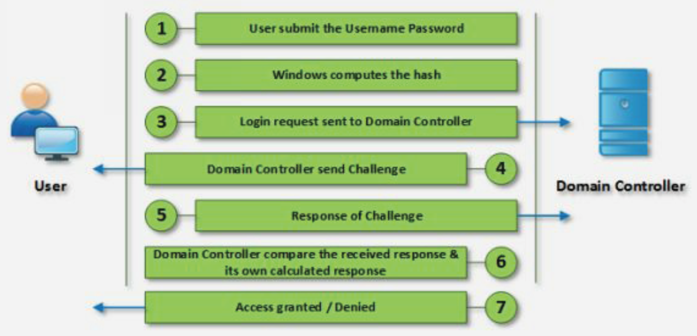

# System Hacking

At this point, attackers have gathered enough information, or should have gathered enough information, to try to compromise the target systems.

This is, without questions, the most difficult phase of an attack or a pentest. In both cases, it is needed patience, tenacity and perseverance. Failures are going to happen, theories are going to be proven wrong, mistakes are going to be made and disappointments are going to happen. After all of this, maybe, attackers or security professionals will get some results. But, as Thomas Edison said, _"I didn't fail. I just found 2,000 ways not to make a lightbulb; I only needed to find one way to make it work."_. Attackers do not fail, they just need to find one way to compromise the system to achieve their objective.

Compromising a system is not a matter of, if it will be or not, it is just about the time and resources necessary to compromise it. Security professionals try to increase the time needed as much as possible and attackers reduce it as much as they can. A system will never be completely secure but, if it is secure enough, the time and resources that need to be invested will not be worth it. Still, there will be attempts just for fun, curiosity or as a challenge but, the ratio of potentially serious attacks will be lower.

Compromise a system is a very broad term. The intentions of an attacker when compromising a system are:

* Gain access
* Privileges escalation
* Maintain remote access
* Steal information, data or any other type of asset
* Clean and hiding pieces of evidence of the attack

There are multiple system hacking methodologies that, at least, include the next steps and match the concept of compromise a system:

1. Cracking passwords
2. Escalating privileges
3. Executing applications
4. Hiden files
5. Covering tracks

## Password Cracking

It is said that a secure system should base its strengthness on three factors:

* Something the user knows, like credentials i.e. username and password.
* Something the user is, like biometrics.
* Something the user has, like a security card or a token generator.

The implementation of the three mechanisms is, maybe, a not simple approach and only very secure systems use it. And, nowadays, there is a tendency on the use of second-factor authentication, usually based on something the user knows and something the user has. This is an excellent tendency that it should be mainstream. But, the unfortunate reality is that a lot of systems are just protected by a pair os username and password.

If attackers have been diligent enough, at this point, they will have a list of enumerated usernames to try in the target systems. At this point, it is where password cracking plays an important part. Guessable passwords, short passwords, passwords with weak encryption, simple passwords with only letters and or numbers make easy for attackers to crack them.

The best defence against these cracking password techniques is to have a strong lengthy and difficult password to guess. Typically, a good password contains:

* Case sensitive letters
* Special characters
* Numbers
* At least, 8 characters length if not more

### Types of Password Attacks

#### Non-Electronic Attacks

Attackers do not need any technical knowledge or tool to perform this attack. Things like:

* Shoulder Surfing
* Social Engineering
* Dumpster Diving

#### Active Online Attacks

Attackers perform password cracking by directly communicating with the victim machine.

* **Dictionary attack**: The dictionary attack, as its name suggests, is a method that uses an index of words that feature most commonly as user passwords. This is a slightly less-sophisticated version of the brute force attack but it still relies on hackers bombarding a system with guesses until something sticks.

* **Brute force attack**: Similar in function to the dictionary attack, the brute force attack is regarded as being a little more sophisticated. Rather than using a list of words, brute force attacks are able to detect non-dictionary terms, such as alpha-numeric combinations. This means passwords that include strings such as "aaa1" or "zzz10" could be at risk from a brute force attack.

* **Hash Injection**: A pass the hash attack is an exploit in which an attacker steals a hashed user credential and, without cracking it, reuses it to trick an authentication system into creating a new authenticated session on the same network.

* **Phishing**: There's an easy way to hack: ask the user for his or her password. A phishing email leads the unsuspecting reader to a faked log in page associated with whatever service it is the hacker wants to access, requesting the user to put right some terrible problem with their security. That page then skims their password and the hacker can go use it for their own purpose.

* **Malware**: A keylogger, or screen scraper, can be installed by malware which records everything you type or takes screenshots during a login process, and then forwards a copy of this file to hacker central.

* **Password Guessing**: The password crackers best friend, of course, is the predictability of the user. Unless a truly random password has been created using software dedicated to the task, a user-generated random' password is unlikely to be anything of the sort. Instead, thanks to our brains' emotional attachment to things we like, the chances are those random passwords are based upon our interests, hobbies, pets, family and so on. In fact, passwords tend to be based on all the things we like to chat about on social networks and even include in our profiles.

#### Passive Online Attacks

Attackers perform password cracking without communicating with the authorizing party.

* **Wire Sniffing**: Sniffing attack or a sniffer attack, in context of network security, corresponds to theft or interception of data by capturing the network traffic using a sniffer (an application aimed at capturing network packets). When data is transmitted across networks, if the data packets are not encrypted, the data within the network packet can be read using a sniffer. Using a sniffer application, an attacker can analyze the network and gain information to eventually cause the network to crash or to become corrupted, or read the communications happening across the network.

* **Man-in-the-Middle**: A man-in-the-middle attack (MITM) is an attack where the attacker secretly relays and possibly alters the communications between two parties who believe that they are directly communicating with each other. The attacker must be able to intercept all relevant messages passing between the two victims and inject new ones. This is straightforward in many circumstances; for example, an attacker within the reception range of an unencrypted wireless access point (Wi-Fi) could insert themselves as a man-in-the-middle.

* **Replay Attack**: A replay attack (also known as playback attack) is a form of network attack in which valid data transmission is maliciously or fraudulently repeated or delayed. This is carried out either by the originator or by an adversary who intercepts the data and re-transmits it, possibly as part of a masquerade attack by IP packet substitution. This is one of the lower-tier versions of a _Man-in-the-middle attack_.

#### Default Password

As mentioned before, a default password is supplied by the manufacturer with new equipment (e.i. switches, hubs, routers) that is password protected. Attackers can easily find lists with compilations of these passwords and use them to access a system.

#### Offline Attack

Attacker copies the target's password file and then tries to crack passwords in his own system at a different location.

* **Pre-Computed Hashes and Rainbow Tables**: Rainbow tables might sound innocuous, but they are in fact incredibly useful tools in a hacker's arsenal. When passwords are stored on a computer system, they are hashed using encryption - the 1-way nature of this process means that it is impossible to see what the password is without the associated hash. Simply put, rainbow tables function as a pre-computed database of passwords and their corresponding hash values. This will then be used as an index to cross-reference hashes found on a computer with those already pre-computed in the rainbow table. Compared to a brute force attack, which does a lot of the computation during the operation, rainbow tables boil the attack down to just a search through a table.

* **Distributed Network**: A Distributed Network Attack (DNA) technique is used for recovering passwords from hashes or password-protected files using the unused processing power of machines across the network to decrypt passwords. The DNA Manager is installed in a central location where machines running on DNA Client can access it over the network. DNA Manager coordinates the attack and allocates small portions of the key search to machines that are distributed over the network. DNA Client runs in the background, consuming only unused processor time. The program combines the processing capabilities of all the clients connected to the network and uses it to crack the password.

#### USB Drive

For this attack, the attacker needs physical access to the target machine. The attacker will insert a USB drive previously prepared with a password cracker tool and an autorun mechanism on the targeted computer. Once the device is connected the tool will try to crack the password.

### Authentication mechanisms

In computer environments, authentication is the verification process to identify a user or device to probe it has legitimate access right to resources. This avoids impostors making use of or accessing resources they should not be allowed ensuring the authentication of users, computers and services.

Microsoft platform implements multiple authentication protocols, among them we can find:

* Kerberos
* Security Account Manager (SAM)
* NT LAN Manager (NTLM)

#### Kerberos

Kerberos is a network authentication protocol. It is designed to provide strong authentication for client/server applications by using secret-key cryptography. The Kerberos protocol uses strong cryptography so that a client can prove its identity to a server (and vice versa) across an insecure network connection. After a client and server have used Kerberos to prove their identity, they can also encrypt all of their communications to assure privacy and data integrity as they go about their business.

Here are the most basic steps taken to authenticate in a Kerberized environment.

1. Client requests an authentication ticket (TGT) from the Key Distribution Center (KDC).
2. The KDC verifies the credentials and sends back an encrypted TGT and session key.
3. The TGT is encrypted using the Ticket Granting Service (TGS) secret key.
4. The client stores the TGT and when it expires the local session manager will request another TGT (this process is transparent to the user).

If the Client is requesting access to a service or other resource on the network, this is the process:

5. The client sends the current TGT to the TGS with the Service Principal Name (SPN) of the resource the client wants to access.
6. The KDC verifies the TGT of the user and that the user has access to the service.
7. TGS sends a valid session key for the service to the client.
8. Client forwards the session key to the service to prove the user has access, and the service grants access.

#### Security Account Manager (SAM)

Windows stores and manages the local user and group accounts in a database file called SecurityAccount Manager (SAM). It authenticates local user logons. On a domain controller, it simply stores the administrator account from the time it was a server, which serves as the Directory Services Restore Mode (DSRM) recovery account.

In the SAM, each user account can be assigned a local area network (LAN) password and a Windows password. Both are encrypted. If someone attempts to log on to the system and the user name and associated passwords match an entry in the SAM, a sequence of events takes place ultimately allowing that person access to the system. If the user name or passwords do not properly match any entry in the SAM, an error message is returned requesting that the information be entered again.

In personal computers (PCs) not connected into a LAN and for which there is only one user, Windows asks for only one password when the system is booted up. This function can be disabled if the user does not want to enter authentication data every time the computer is switched on or restarted. The main purpose of the SAM in a PC environment is to make it difficult for a thief to access the data on a stolen machine. It can also provide some measure of security against online hackers.

The user passwords are stored in a hashed format in a registry hive either as a LM hash or as a NTLM hash. Windows XP or later versions do not store the value of LM hash or, if it exceeds fourteen characters, it stores blank or a dummy value instead. This file can be found in `%SystemRoot%/system32/config/SAM` and is mounted on `HKLM/SAM`. This information is stored following the next format:

`username:userId:LMHash:NTLMHash:::`

#### NT LAN Manager (NTLM)

NT (New Technology) LAN Manager (NTLM) is a suite of [Microsoft security protocols](https://docs.microsoft.com/en-us/openspecs/windows_protocols/ms-nlmp/b38c36ed-2804-4868-a9ff-8dd3182128e4) intended to provide authentication, integrity, and confidentiality to users.

NTLM is a challenge-response authentication protocol which uses three messages to authenticate a client in a connection-oriented environment (connectionless is similar), and a fourth additional message if integrity is desired.

1. First, the client establishes a network path to the server and sends a `NEGOTIATE_MESSAGE` advertising its capabilities.
2. Next, the server responds with `CHALLENGE_MESSAGE` which is used to establish the identity of the client.
3. Finally, the client responds to the challenge with an `AUTHENTICATE_MESSAGE`.

The NTLM authentication process can be observed in the image below

Before Kerberos, Microsoft used NTLM technology. The biggest difference between the two systems is the third-party verification and stronger encryption capability in Kerberos. This extra step in the process provides a significant additional layer of security over NTLM.

### Protecting Passwords

When passwords are stored they should not be stores as plain text, to avoid this, there are a few techniques that can be used:

* **Encryption**: Encryption is the practice of scrambling information in a way that only someone with a corresponding key can unscramble and read it. Encryption is a two-way function. When you encrypt something, you are doing so with the intention to decrypting it later. To encrypt data it is used an algorithm – a series of well-defined steps that can be followed procedurally – to encrypt and decrypt information.

* **Hashing**: Hashing is the practice of using an algorithm to map data of any size to a fixed length. This is called a hash value. Whereas encryption is a two-way function, hashing is a one-way function. While it is technically possible to reverse-hash something, the computing power required makes it unfeasible.

* **Salting**: Salting is a concept that typically pertains to password hashing. Essentially, it is a unique value that can be added to the end of the password to create a different hash value. This adds a layer of security to the hashing process, specifically against brute force attacks.

Despite all these techniques, hashes can be cracked or, at least, there a few techniques that can try to crack a hash.

* **Dictionary and Brute Force Attacks**: The simplest way to crack a hash is to try to guess the password, hashing each guess, and checking if the guess's hash equals the hash being cracked. If the hashes are equal, the guess is the password. The two most common ways of guessing passwords are dictionary attacks and brute-force attacks.

* **Lookup Tables**: Lookup tables are an extremely effective method for cracking many hashes of the same type very quickly. The general idea is to pre-compute the hashes of the passwords in a password dictionary and store them, and their corresponding password, in a lookup table data structure. A good implementation of a lookup table can process hundreds of hash lookups per second, even when they contain many billions of hashes.

* **Reverse Lookup Tables**: This attack allows an attacker to apply a dictionary or brute-force attack to many hashes at the same time, without having to pre-compute a lookup table. First, the attacker creates a lookup table that maps each password hash from the compromised user account database to a list of users who had that hash. The attacker then hashes each password guess and uses the lookup table to get a list of users whose password was the attacker's guess. This attack is especially effective because it is common for many users to have the same password.

* **Rainbow Tables**: Already seen it before but, rainbow tables are a time-memory trade-off technique. They are like lookup tables, except that they sacrifice hash cracking speed to make the lookup tables smaller. Because they are smaller, the solutions to more hashes can be stored in the same amount of space, making them more effective. Rainbow tables that can crack any md5 hash of a password up to 8 characters long exist.

### Password Cracking Tools

There are a plethora of password cracking tools out there. A few of them are:

* John the Ripper
* Hashcat
* THC Hydra
* Medusa
* Ophcrack

// TODO Examples

## Escalating Privileges

