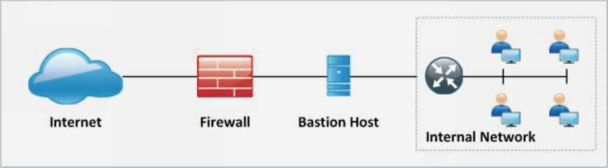
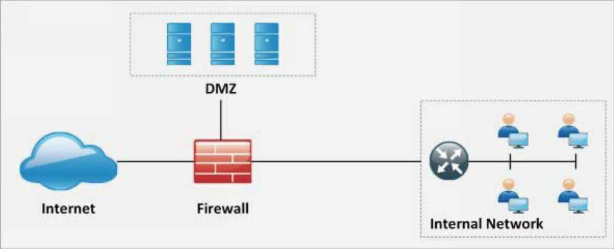
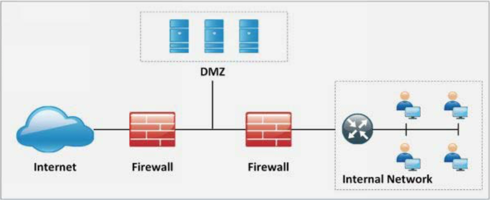
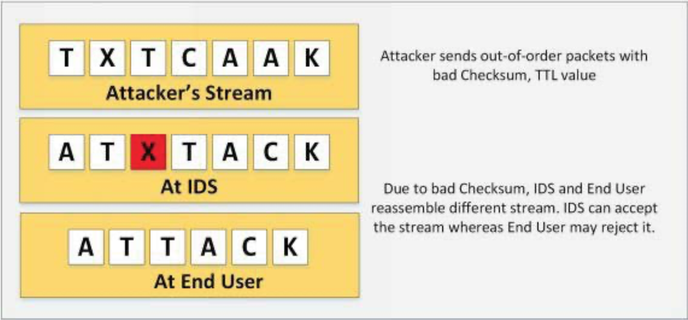
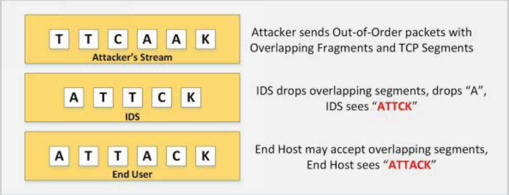

# Evading IDS, Firewall and Honeypots

Attacks are getting more common day after day and attackers seem more numerous by the minute but, despite this being true or not, the truth is that companies are subjected to constant attacks. Can it be that the number of attackers is exponentially growing? Maybe, but a more simple explanation is automation.

Attacks are not just performed manually, they are performed automatically by computers with software specifically implemented for this purpose.

Attackers have been developing for a long time tools to make their life easier and simpler. All these tools run attacks without or just minimal human supervision.

For this reason, automation, security tools need to be equipped to deal with all this volume of attacks and the huge amount of traffic generated by them. Doing this manually, it will be impossible, well, probably disconnecting the system from all external signals.

Modern networked business environments require a high level of security to ensure safe and trusted communication of information between various organizations. This is why tools like Firewalls, Intrusion Detection Systems, Intrusion Prevention Systems and Honeypots, receive and have so much importance when networks and systems need to be protected.

## Intrusion Detection Systems

An intrusion detection system (IDS) is a device or software application that monitors a network for malicious activity or policy violations. Any malicious activity or violation is typically reported or collected centrally using a security information and event management system. Some IDSs are capable of responding to detected intrusion upon discovery. These are classified as intrusion prevention systems (IPS).

An intrusion detection system acts as an adaptable safeguard technology for system security after traditional technologies fail. Cyber attacks will only become more sophisticated, so it is important that protection technologies adapt along with their threats.

### IDS Detection Types

There is a wide array of IDS, ranging from antivirus software to tiered monitoring systems that follow the traffic of an entire network. The most common classifications are:

* **Network intrusion detection systems (NIDS)**: A system that analyzes incoming network traffic.

* **Host-based intrusion detection systems (HIDS)**: A system that monitors important operating system files.

There is also a subset of IDS types. The most common variants are based on signature detection and anomaly detection.

* **Signature-based**: Signature-based IDS detects possible threats by looking for specific patterns, such as byte sequences in network traffic, or known malicious instruction sequences used by malware. This terminology originates from antivirus software, which refers to these detected patterns as signatures. Although signature-based IDS can easily detect known attacks, it is impossible to detect new attacks, for which no pattern is available.

* **Anomaly-based**: A newer technology designed to detect and adapt to unknown attacks, primarily due to the explosion of malware. This detection method uses machine learning to create a defined model of trustworthy activity, and then compare new behaviour against this trust model. While this approach enables the detection of previously unknown attacks, it can suffer from false positives: previously unknown legitimate activity can accidentally be classified as malicious.

### IDS Usage in Networks

When placed at a strategic point or points within a network to monitor traffic to and from all devices on the network, an IDS will perform an analysis of passing traffic, and match the traffic that is passed on the subnets to the library of known attacks. Once an attack is identified, or abnormal behaviour is sensed, the alert can be sent to the administrator.

### Evasion Techniques

Being aware of the techniques available to cybercriminals who are trying to breach a secure network can help IT departments understand how IDS systems can be tricked into not missing actionable threats:

* **Fragmentation**: Sending fragmented packets allow the attacker to stay under the radar, bypassing the detection system's ability to detect the attack signature.

* **Avoiding defaults**: A port utilized by a protocol does not always provide an indication to the protocol that’s being transported. If an attacker had reconfigured it to use a different port, the IDS may not be able to detect the presence of a trojan.

* **Coordinated, low-bandwidth attacks**: Coordinating a scan among numerous attackers, or even allocating various ports or hosts to different attackers. This makes it difficult for the IDS to correlate the captured packets and deduce that a network scan is in progress.

* **Address spoofing/proxying**: Attackers can obscure the source of the attack by using poorly secured or incorrectly configured proxy servers to bounce an attack. If the source is spoofed and bounced by a server, it makes it very difficult to detect.

* **Pattern change evasion**: IDS rely on pattern matching to detect attacks. By making slight adjustments to the attack architecture, detection can be avoided.

## Intrusion Prevention Systems

An intrusion prevention system (IPS) is an automated network security device used to monitor and respond to potential threats. Like an intrusion detection system (IDS), an IPS determines possible threats by examining network traffic. Because an exploit may be carried out very quickly after an attacker gains access, intrusion prevention systems administer an automated response to a threat, based on rules established by the network administrator.

The main functions of an IPS are to identify suspicious activity, log relevant information, attempt to block the activity, and finally to report it.

IPSs include firewalls, anti-virus software, and anti-spoofing software. In addition, organizations will use an IPS for other purposes, such as identifying problems with security policies, documenting existing threats and deterring individuals from violating security policies. IPS have become an important component of all major security infrastructures in modern organizations.

An intrusion prevention system acts as an adaptable safeguard technology for system security after traditional technologies. The ability to prevent intrusions through an automated action, without requiring IT intervention means lower costs and greater performance flexibility. Cyber attacks will only become more sophisticated, so it is important that protection technologies adapt along with their threats.

### How An IPS Works

An intrusion prevention system works by actively scanning forwarded network traffic for malicious activities and known attack patterns. The IPS engine analyzes the network traffic and continuously compares the bitstream with its internal signature database for known attack patterns. An IPS might drop a packet determined to be malicious, and follow up this action by blocking all future traffic from the attacker’s IP address or port. Legitimate traffic can continue without any perceived disruption in service.

Intrusion prevention systems can also perform more complicated observation and analysis, such as watching and reacting to suspicious traffic patterns or packets. Detection mechanisms can include:

* Address matching
* HTTP string and substring matching
* Generic pattern matching
* TCP connection analysis
* Packet anomaly detection
* Traffic anomaly detection
* TCP/UDP port matching

An IPS will typically record information related to observed events, notify security administrators, and produce reports. To help secure a network, an IPS can automatically receive prevention and security updates in order to continuously monitor and block emerging Internet threats.

### IPS Classifications

Intrusion prevention systems can be organized into four major types:

* **Network-based intrusion prevention system (NIPS)**: Analyzes protocol activity across the entire network, looking for any untrustworthy traffic.

* **Wireless intrusion prevention system (WIPS)**: Analyzes network protocol activity across the entire wireless network, looking for any untrustworthy traffic.

* **Host-based intrusion prevention system (HIPS)**: A secondary software package that follows a single host for malicious activity, and analyzes events occurring within the host.

* **Network behaviour analysis (NBA)**: Examines network traffic to identify threats that generate strange traffic flows. The most common threats being distributed denial of service attacks, various forms of malware, and policy abuses. pattern matching to detect attacks. By making slight adjustments to the attack architecture, detection can be avoided.

### IPS Detection Methods

The majority of intrusion prevention systems use one of three detection methods: signature-based, statistical anomaly-based, and stateful protocol analysis.

* **Signature-based detection**: Signature-based IDS monitors packets in the network and compares with predetermined attack patterns, known as "signatures".

* **Statistical anomaly-based detection**: An anomaly-based IDS will monitor network traffic and compare it to expected traffic patterns. The baseline will identify what is "normal" for that network – what sort of packets generally through the network and what protocols are used. It may however, raise a false positive alarm for the legitimate use of bandwidth if the baselines are not intelligently configured.

* **Stateful protocol analysis detection**: This method identifies protocol deviations by comparing observed events with pre-determined activity profiles of normal activity.

### Intrusion Countermeasures

Many IPS can also respond to a detected threat by actively preventing it from succeeding. They use several response techniques, which involve:

* Changing the security environment, for example, by configuring a firewall to increase protections against previously unknown vulnerabilities.

* Changing the attack's content, for example, by replacing otherwise malicious parts of an email, like false links, with warnings about the deleted content.

* Sending automated alarms to system administrators, notifying them of possible security breaches.

* Dropping detected malicious packets.

* Resetting a connection.

* Blocking traffic from the offending IP address.

| Feature | IPD | IDS |
|:-|:-|:-|
| Positioning | In-line in the network. Every packet goes through it. | Not-inline with the network. It receives a copy of every packet. |
| Mode | In-line/Tap | Promiscuous |
| Delay | Introduces delay because every packet is analysed before forwarded to a destination. | Does not introduce delay because it is not in-line within the network. |
| Point of failure? | Yes, depending on the configuration. Fail-open or fail-close will drop or not all the traffic. | No impact on traffic as is not in-line with the network. |
| Ability to mitigate an attack? | Yes, ability to drop malicious traffic unless in 'Tap mode'. | Not directly but, it can help other in-line solutions. |
| Can do packet manipulation? | Yes. It can modify traffic based on defined rules. | No. Just receives mirrored traffic. |

## Host-Based vs Network-Based solutions

| Feature | Host-based IDS/IPS | Network-based IDS/IPS |
|:-|:-|:-|
| Scalability | Not scalable as the number of host increases | Highly scalable. Normally deployed at the perimeter gateway. |
| Cost-effectiveness | Low. More systems, means more IDS/IPS systems. | High. One pair can monitor the overall network. |
| Capability | Capable of verifying if an attack was successful or not. | Only capable of generating an alert of an attack. |
| Processing power | The processing power of the host device used. | Must have a high processing power to overcome latency issues. |

### Host-Based IPS/IDS Types

* **File system monitoring**: It monitors changes in system files trying to detect manipulation or alteration. Usually, hash functions are used, storing the previous version and comparing it with the actual.

* **Log Files Analysis**: It works by analysing log files and generating appropriate warning for administrators. A number of modern tools analyse the pattern of behaviours and performing a further correlation with actual events.

* **Connection Analysis**: Tries to analyse all network connections and tries to differentiate between legitimate and unauthorised traffic.

* **Kernel Level Detection**: The OS kernel itself tries to detect alteration on the system binaries and, in case of anomalies, raises the intrusion attempt.

## Firewalls

Network firewalls are security devices used to stop or mitigate unauthorized access to private networks connected to the Internet, especially intranets. The only traffic allowed on the network is defined via firewall policies – any other traffic attempting to access the network is blocked. Network firewalls sit at the front line of a network, acting as a communications liaison between internal and external devices.

A network firewall can be configured so that any data entering or exiting the network has to pass through it – it accomplishes this by examining each incoming message and rejecting those that fail to meet the defined security criteria. When properly configured, a firewall allows users to access any of the resources they need while simultaneously keeping out unwanted users, hackers, viruses, worms or other malicious programs trying to access the protected network.

### Software vs. Hardware Firewalls

Firewalls can be either hardware or software. In addition to limiting access to a protected computer and network, a firewall can log all traffic coming into or leaving a network, and manage remote access to a private network through secure authentication certificates and logins.

* **Hardware firewalls**: These firewalls are released either as standalone products for corporate use, or more often, as a built-in component of a router or other networking device. They are considered an essential part of any traditional security system and network configuration. Hardware firewalls will almost always come with a minimum of four network ports that allow connections to multiple systems. For larger networks, a more expansive networking firewall solution is available.

* **Software firewalls**: These are installed on a computer, or provided by an OS or network device manufacturer. They can be customized, and provide a smaller level of control over functions and protection features. A software firewall can protect a system from standard control and access attempts, but have trouble with more sophisticated network breaches.

A firewall is considered an endpoint protection technology. In protecting private information, a firewall can be considered the first line of defence, but it cannot be the only defence.

### Firewall Types

Firewalls are relied upon to secure home and corporate networks. A simple firewall program or device will sift through all information passing through the network – this process can also be customized depending on the needs of the user and the capabilities of the firewall. There are a number of major firewall types that prevent harmful information from passing through the network:

* **Application-layer**: This is a hardware appliance, software filter, or server plug-in. It layers security mechanisms on top of defined applications, such as FTP servers, and defines rules for HTTP connections. These rules are built for each application, to help identify and block attacks to a network.

* **Packet Filtering**: This filter examines every packet that passes through the network – and then accepts or denies it as defined by rules set by the user. Packet filtering can be very helpful, but it can be challenging to properly configure. Also, it’s vulnerable to IP spoofing.

* **Circuit-level**: This firewall type applies a variety of security mechanisms once a UDP or TCP connection has been made. Once the connection is established, packets are exchanged directly between hosts without further oversight or filtering.

* **Proxy Server**: This version will check all messages that enter or leave a network, and then hide the real network addresses from any external inspection.

* **Next-Generation (NGFW)**: These work by filtering traffic moving through a network - the filtering is determined by the applications or traffic types and the ports they are assigned to. These features comprise a blend of a standard firewall with additional functionality, to help with greater, more self-sufficient network inspection.

* **Stateful Firewalls**: Sometimes referred to as third-generation firewall technology, stateful filtering accomplishes two things: traffic classification based on the destination port, and packet tracking of every interaction between internal connections. These newer technologies increase usability and assist in expanding access control granularity – interactions are no longer defined by port and protocol. A packet’s history in the state table is also measured.

All of these network firewall types are useful for power users, and many firewalls will allow for two or more of these techniques to be used in tandem with one another.

### Cloud Firewalls

Cloud Firewalls are software-based, cloud-deployed network devices, built to stop or mitigate unwanted access to private networks. As a new technology, they are designed for modern business needs, and sit within online application environments.

#### Cloud Firewall Benefits

* **Scalability**: Because deployment is much simpler, organizations can adjust the size of their security solution without the frustrations inherent with on-site installation, maintenance and upgrading. As bandwidth increases, cloud firewalls can automatically adjust to maintain parity. For example, distributed denial-of-service (DDoS) attacks can be mitigated without having to worry about bandwidth limits.

* **Availability**: Cloud firewall providers account for the built-in cost of high availability by supporting infrastructure. This means guaranteeing redundant power, HVAC, and network services, and automating backup strategies in the event of a site failure. This availability is hard to match with on-premises firewall solutions because of the cost and support required. This also means that necessary updates can be implemented immediately, without the need for large system downloads or updates.

* **Extensibility**: Cloud firewalls can be reached and installed anywhere an organization can provide a protected network communication path. With an on-premises device, this extensibility is limited by the available resources of the organization looking for a firewall solution.

* **Migration Security**: A cloud firewall is capable of filtering traffic from a variety of sources; the internet, between virtual networks, between tenants, or even a virtual data centre. It is capable of guaranteeing the security of connections made between physical data centres and the cloud – this is very beneficial for organizations looking for a means of migrating current solutions from an on-prem location to a cloud-based infrastructure.

* **Secure Access Parity**: Cloud firewalls provide the same level of secure access as on-prem firewalls. This means advanced access policy, connection management, and filtering between clients and the cloud. This also extends to encrypted content.

* **Identity Protection**: Cloud firewalls can integrate with access control providers and give users granular control over filtering tools.

* **Performance Management**: Cloud firewalls provide tools for controlling performance, visibility, usage, configuration, and logging – all things normally associated with an on-prem solution.

#### Cloud Firewall Types

There are two types of cloud firewalls – with the distinction being defined by what users need help securing. Both types exist as cloud-based software that monitors all incoming and outgoing data packets, and filters this information against access policies with the goal of blocking and logging suspicious traffic.

* **SaaS Firewalls**: They are designed to secure an organization's network and its users, not unlike a traditional on-premises hardware or software firewall. The only difference is that it is deployed off-site from the cloud. This type of firewall can be called:

    * Software-as-a-service firewall (SaaS firewall)
    * Security-as-a-service (SECaaS)
    * Firewall-as-a-service (FWaaS)

* **Next-Generation Firewalls**: They are cloud-based services intended to deploy within a virtual data centre. They protect an organization’s own servers in a platform-as-a-service (PaaS) or infrastructure-as-a-service (IaaS) model. The firewall application exists on a virtual server and secures incoming and outgoing traffic between cloud-based applications.

### Firewall Architecture

#### Bastion Host

A bastion host is a computer system that is placed in between the public and the private network. It is intended to be the crossing point where all traffic is passed through. Certain roles and responsibilities are assigned to this computer to perform. Bastion hosts have two interfaces, one connected to the public network while the other connected to the private network.

#### Screened Subnet

A screened subnet can be set with a firewall with three interfaces. These interfaces connect the public, private and to the demilitarised zone (DMZ). In this architecture, the attempt is to isolate the different zones.

#### Multi-homed Firewall

A multi-homed firewall is a firewall that has more than one network interface, with each interface connected to logically and physically separate network segments. It increases the efficiency and reliability of a network.

### Demilitarized Zone

A DMZ network functions as a subnetwork containing an organization's exposed, outward-facing services. It acts as the exposed point to an untrusted network, commonly the Internet.

The goal of a DMZ is to add an extra layer of security to an organization's local area network. A protected and monitored network node that faces outside the internal network can access what is exposed in the DMZ, while the rest of the organization's network is safe behind a firewall.

When implemented properly, a DMZ network gives organizations extra protection in detecting and mitigating security breaches before they reach the internal network, where valuable assets are stored.

The DMZ network exists to protect the hosts most vulnerable to attack. These hosts usually involve services that extend to users outside of the local area network, the most common examples being email, web servers, and DNS servers. Because of the increased potential for attack, they are placed into the monitored subnetwork to help protect the rest of the network if they become compromised.

Hosts in the DMZ have tightly controlled access permissions to other services within the internal network, because the data passed through the DMZ is not as secure. On top of that, communications between hosts in the DMZ and the external network are also restricted to help increase the protected border zone. This allows hosts in the protected network to interact with the internal and external network, while the firewall separates and manages all traffic shared between the DMZ and the internal network. Typically, an additional firewall will be responsible for protecting the DMZ from exposure to everything on the external network. They usually implement some features like:

* Stateful inspection
* Packet filtering
* URL filtering
* Transparent firewall
* Virtual Routing Forwarding (VRF)

## Honeypots

Honeypots are decoy systems or servers deployed alongside production systems within your network. When deployed as enticing targets for attackers, honeypots can add security monitoring opportunities for blue teams and misdirect the adversary from their true target. Honeypots come in a variety of complexities depending on the needs of your organization and can be a significant line of defence when it comes to flagging attacks early. This page will get into more detail on what honeypots are, how they are used, and the benefits of implementing them.

Honeypots offer plenty of security benefits to organizations that choose to implement them, including the following:

* They break the attacker kill chain and slow attackers down.
* They are straightforward and low-maintenance.
* They help you test your incident response processes.

### Honeypot Types

Within production and research honeypots, there are also differing tiers depending on the level of complexity your organization needs:

* **Pure honeypot**: This is a full-scale, completely production-mimicking system that runs on various servers. It contains “confidential” data and user information, and is full of sensors. Though these can be complex and difficult to maintain, the information they provide is invaluable.

* **High-interaction honeypot**: This is similar to a pure honeypot in that it runs a lot of services, but it is not as complex and does not hold as much data. High-interaction honeypots are not meant to mimic a full-scale production system, but they do run (or appear to run) all the services that a production system would run, including a proper operating system. This type of honeypot allows the deploying organization to see attacker behaviours and techniques. High-interaction honeypots are resource-intensive and come with maintenance challenges, but the findings can be worth the squeeze.

* **Mid-interaction honeypot**: These emulate aspects of the application layer but do not have their own operating system. They work to stall or confuse attackers so that organizations have more time to figure out how to properly react to an attack.

* **Low-interaction honeypot**: This type of honeypot is the most commonly deployed in a production environment. Low-interaction honeypots run a handful of services and serve as an early warning detection mechanism more than anything. They are easy to deploy and maintain, with many security teams deploying multiple honeypots across different segments of their network.

### Honeypot Technologies

Several honeypot technologies in use include the following: 

* **Malware honeypots**: These use known replication and attack vectors to detect malware. For example, honeypots (e.g., Ghost) have been crafted to emulate as a USB storage device. If a machine is infected by malware that spreads via USB, the honeypot will trick the malware to infect the emulated device.

* **Spam honeypots**: These are used to emulate open mail relays and open proxies. Spammers will test the open mail relay by sending themselves an email first. If they succeed, they then send out large quantities of spam. This type of honeypot can detect and recognize this test and successfully block the massive volume of spam that follows.

* **Database honeypot**: Activities such as SQL injections can often go undetected by firewalls, so some organizations will use a database firewall, which can provide honeypot support to create decoy databases.

* **Client honeypots**: Most honeypots are servers listening for connections. Client honeypots actively seek out malicious servers that attack clients, monitoring for suspicious and unexpected modifications to the honeypot. These systems generally run on virtualization technology and have a containment strategy to minimize risk to the research team.

* **Honeynets**: Rather than being a single system, a honeynet is a network that can consist of multiple honeypots. Honeynets aim to strategically track the methods and motives of an attacker while containing all inbound and outbound traffic.

## Evading IDS

### Insertion Attacks

IDSs can accept packets that end-systems reject. IDSs that do this make the mistake of believing that end-systems have accepted and processed the packet when they actually have not. Attackers can exploit this condition by sending packets to end-systems that they will reject, but that IDSs will think are valid. By doing this, the attackers are "_inserting_" data into IDSs, no other systems on the network care about the bad packets. Attackers can use insertion attacks to defeat signature analysis, allowing them to slip attacks past IDSs.

Taking advantage of a vulnerability attackers can insert packets with a bad checksum or TTL values and send them out of order. IDSs and end hosts, when reassembling the packet, they might have two different streams. For example, attackers may send the following stream:

### Evasion

End-systems can accept packets that an IDSs reject. IDSs that mistakenly reject such a packet miss their content entirely. This condition can also be exploited, this time by slipping crucial information past the IDSs in packets that IDSs is too strict about processing. These packets are '_evading_' the scrutiny of IDSs.

We call these '_evasion_' attacks, and they are the easiest to exploit and most devastating to the accuracy of IDSs. Entire sessions can be carried forth in packets that evade an IDS, and blatantly obvious attacks couched in such sessions will happen right under the nose of even the most sophisticated analysis engines.

Evasion attacks foil pattern matching in a manner quite similar to insertion attacks. Again, attackers cause IDSs to see a different stream of data than the end-system, this time, however, end-systems see more than IDSs, and the information that IDSs miss is critical to the detection of an attack.

### Fragmentation Attack

IP fragmentation is the process of dividing packets into smaller chunks. These need to be of a specific size so that the receiving parties could process them and transfer data successfully. All these packets are then reassembled by the receiving party so they can understand the data they got.

This technique is usually adopted when IDSs and hosts have different timeout configured. For example, a host with a 20 seconds timeout and an IDS with 10 seconds. If attackers send packets with 15 seconds delays, they will not be reassembled at the IDS but they will be at the host.

Similarly, overlapping fragments can be sent configuring their TCP sequence as overlapped. The reassembly of these overlapping packets will depend on how the operative system is configured to perform this action.

### Denial-of-Service

Passive IDSs devices are configured as '_Fail-Open_'. Taking advantage of this limitation, attackers can run a DoS attack to overload an IDS system. They can target the CPU or memory by sending specially crafted packets or a large number of fragmented out-of-order packets.

### Obfuscation

Obfuscation is the encryption of the payload in a way that an IDS cannot reserve the encryption but the final system can. Encrypted protocols are not inspected by IDSs unless they have the private key configured. Similarly, attackers can use polymorphic shellcodes to create unique patterns to evade IDSs.

### False Positive Generation

Attackers can generate a large number of false-positive alerts trying to hide the malicious packet with in the noise.

### Unicode Evasion Technique

In this case, attackers can use Unicode, a form of character encoding, to evade IDSs inspection. Converting a string to Unicode characters can avoid signature matching and alerts in the IDSs.

## Evading Firewalls

### Firewall Identification

The identification of firewalls includes firewall fingerprinting to obtain sensitive information such as open ports, version information, services running, etc. Different techniques can be used among the ones the next can be found:

* ***Port Scanning**: Special packets can be sent to particular hosts to analyse the responses and infer information about the environment, specially open ports.

* **Fire-walking**: It is a technique that using ICMP packets finds out the location of the firewall and allows to map a network by probing the ICMP echo request with TTL values exceeding one by one. It helps to find the number of hoops.

* **Banner Grabbing**: The different devices that can be found in a network display different banner, vendor information, that can be identified and device and firmware can be extracted.

* **IP Address Spoof**: Attackers can send packets with spoofed IP addresses to impersonate user machines and gain unauthorised access.

* **Source Routing**: This technique sends a spoofed packet using a specific route that mimics the legitimate user path.

### By-Passing Techniques

* **By-passing blocked sites using IP addresses**: Instead of the use of an URL and its domain to access it, attackers can try to access using its IP address if this type of access is not blocked.

* **By-passing blocked sites using proxies**: The use of proxies to access restricted websites is very common hiding the real IP and using the proxy IP address to access the website.

* **By-passing through ICMP tunnelling method**: ICMP tunnelling is a technique of injecting arbitrary data in the payload of an echo packet and forwarded to the target host. In this scenario, a TCP connection is tunnelled over ping requests and replays because firewalls do not examined the payload field of ICMP packets.

* **By-passing through HTTP tunnelling method**: It is taking advantage of a legitimate HTTP server deployed, encapsulating data into the HTTP traffic and using services as FTP.

* **By-passing through SSH tunnelling method**: An attacker can use OpenSSH to encrypt the traffic and avoid the detection by security devices.

* **By-passing through external systems**: This process involves to hijack the session of a valid user with permissions to connect to external networks and using that session to by-pass the firewall.

// TODO Tools: snort
