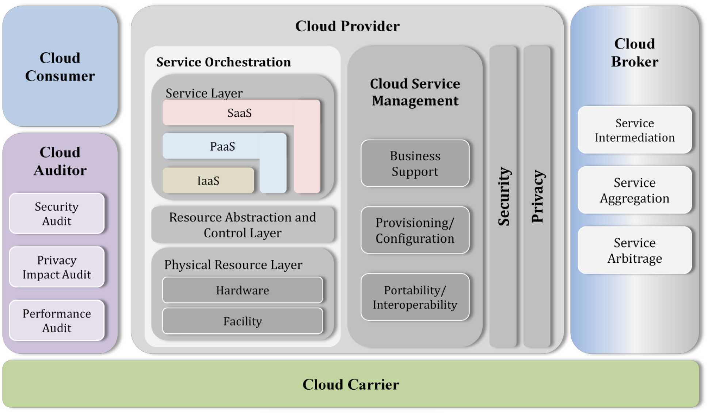

# Cloud Computing

Cloud computing has two meanings. The most common refers to running workloads remotely over the internet in a commercial provider's data centre, also known as the "public cloud" model. Popular public cloud offerings such as Amazon Web Services (AWS), Google Cloud Platform (GCP) and Microsoft Azure, all exemplify this familiar notion of cloud computing. Today, most businesses take a multi-cloud approach, which simply means they use more than one public cloud service.

The second meaning of cloud computing describes how it works: a virtualized pool of resources, from raw compute power to application functionality, available on demand. When customers procure cloud services, the provider fulfils those requests using advanced automation rather than manual provisioning. The key advantage is agility: the ability to apply abstracted compute, storage, and network resources to workloads as needed and tap into an abundance of prebuilt services. MAjor characteristics of cloud computing include:

* On-demand self-service
* Distributed storage
* Rapid elasticity
* Measured services
* Automated management
* Virtualisation

## Typed of Cloud Computing Services

The array of available cloud computing services is vast, but most fall into one of the following categories:

### SaaS (Software as a Service)

This type of public cloud computing delivers applications over the internet through the browser. The most popular SaaS applications for business can be found in Google's G Suite and Microsoft's Office 365; among enterprise applications, Salesforce leads the pack. But virtually all enterprise applications, including ERP suites from Oracle and SAP, have adopted the SaaS model. Typically, SaaS applications offer extensive configuration options as well as development environments that enable customers to code their own modifications and additions.

### IaaS (Infrastructure as a Service)

At a basic level, IaaS public cloud providers offer storage and compute services on a pay-per-use basis. But the full array of services offered by all major public cloud providers is staggering: highly scalable databases, virtual private networks, big data analytics, developer tools, machine learning, application monitoring, and so on. Amazon Web Services was the first IaaS provider and remains the leader, followed by Microsoft Azure, Google Cloud Platform, and IBM Cloud.

### PaaS (Platform as a Service)

PaaS provides sets of services and workflows that specifically target developers, who can use shared tools, processes, and APIs to accelerate the development, testing, and deployment of applications. Salesforce's Heroku and Force.com are popular public cloud PaaS offerings; Pivotal's Cloud Foundry and Red Hat's OpenShift can be deployed on-premises or accessed through the major public clouds. For enterprises, PaaS can ensure that developers have ready access to resources, follow certain processes, and use only a specific array of services, while operators maintain the underlying infrastructure.

### FaaS (Functions as a Service)

FaaS, the cloud version of serverless computing, adds another layer of abstraction to PaaS so that developers are completely insulated from everything in the stack below their code. Instead of futzing with virtual servers, containers, and application runtimes, they upload narrowly functional blocks of code, and set them to be triggered by a certain event (such as a form submission or uploaded file). All the major clouds offer FaaS on top of IaaS: AWS Lambda, Azure Functions, Google Cloud Functions, and IBM OpenWhisk. A special benefit of FaaS applications is that they consume no IaaS resources until an event occurs, reducing pay-per-use fees.

## Cloud Deployment Models

### Public Cloud

In a public cloud, individual businesses share on-premise and access to basic computer infrastructure (servers, storage, networks, development platforms etc.) provided by a CSP. Each company shares the CSP's infrastructure with the other companies that have subscribed to the cloud. Payment is usually pay-as-you-go with no minimum time requirements. Some CSPs derive revenue from advertising and offer free public clouds.

Public clouds are usually based on massive hardware installations distributed in locations throughout the country or across the globe. Their size enables economies of scale that permit maximum scalability to meet requirements as a company's needs expand or contract, maximum flexibility to meet surges in demand in real-time, and maximum reliability in case of hardware failures.

Public clouds are highly cost-effective because the business only pays for the computer resources it uses. In addition, the business has access to state-of-the-art computer infrastructure without having to purchase it and hire IT staff to install and maintain it.

The main disadvantage of public clouds is that advanced security and privacy provisions are beyond their capabilities. For example, public clouds cannot meet many regulatory compliance requirements because their tenants share the same computer infrastructure. In addition, large CSP's often implement their public clouds on hardware installations located outside the United States which may be a concern for some businesses.

Public clouds are well suited for hosting development platforms or web browsers, for big data processing that places heavy demands on computer resources, and for companies that do not have advanced security concerns.

### Private Cloud

In a private cloud, a business has access to infrastructure in the cloud that is not shared with anyone else. The business typically deploys its own platforms and software applications on the cloud infrastructure. The business's infrastructure usually lies behind a firewall that is accessed through the company intranet over encrypted connections. Payment is often based on a fee-per-unit-time model.

Private clouds have the significant advantage of being able to provide enhanced levels of security and privacy because computer infrastructure is dedicated to a single client. Sarbanes Oxley, PCI and HIPAA compliance are all possible in a private cloud. In addition, private cloud CSPs are more likely to customize the cloud to meet a company's needs.

An important disadvantage of private clouds for some companies is that the company is responsible for managing their own development platforms and software applications on the CSP's infrastructure. While this gives the business substantial control on the software side, it comes at the cost of having to employ IT staff that can handle the company's cloud deployment. Recognizing this disadvantage, some CSPs provide software applications and a virtual desktop within a company's private cloud.

Private clouds have the additional disadvantages that they tend to be more expensive and the company is limited to using the infrastructure specified in their contract with the CSP.

### Hybrid Cloud

In a hybrid cloud, a company's cloud deployment is split between public and private cloud infrastructure. Sensitive data remains within the private cloud where high-security standards can be maintained. Operations that do not make use of sensitive data are carried out in the public cloud where infrastructure can scale to meet demands and costs are reduced.

Hybrid clouds are well suited to carrying out big data operations on non-sensitive data in the public cloud while keeping sensitive data protected in the private cloud. Hybrid clouds also give companies the option of running their public-facing applications or their capacity intensive development platforms in the public portion of the cloud while their sensitive data remains protected.

### Community Cloud

Community clouds are a recent variation on the private cloud model that provide a complete cloud solution for specific business communities. Businesses share infrastructure provided by the CSP for software and development tools that are designed to meet community needs. In addition, each business has its own private cloud space that is built to meet the security, privacy and compliance needs that are common in the community.

Community clouds are an attractive option for companies in the health, financial or legal spheres that are subject to strict regulatory compliance. They are also well-suited to managing joint projects that benefit from sharing community-specific software applications or development platforms.

The recent development of community clouds illustrates how cloud computing is evolving. CSPs can combine different types of clouds with different service models  to provide businesses with attractive cloud solutions that meet a company's needs.

## NIST Cloud Computing Reference Architecture

The NIST cloud computing reference architecture defines five major actors: cloud consumer, cloud provider, cloud carrier, cloud auditor and cloud broker. Each actor is an entity (a person or an organization) that participates in a transaction or process and/or performs tasks in cloud computing. This reference architecture is based on recommendations of the National Institute of Standards and Technology.

| Actor | Definition |
|:-|:-|
| Cloud Consumer | A person or organization that maintains a business relationship with, and uses service from, Cloud Providers |
| Cloud Provider | A person, organization, or entity responsible for making a service available to interested parties |
| Cloud Auditor | A party that can conduct an independent assessment of cloud services, information system operations, performance and security of the cloud implementation |
| Cloud Broker | An entity that manages the use, performance and delivery of cloud services, and negotiates relationships between Cloud Providers and Cloud Consumers |
| Cloud Carrier | An intermediary that provides connectivity and transport of cloud services from Cloud Providers to Cloud Consumers |

The paper can be consulted [here](https://nvlpubs.nist.gov/nistpubs/Legacy/SP/nistspecialpublication500-292.pdf).

## Cloud Computing Benefits

There are multiple benefits offered by cloud computing, some of them are:

* **Cost Savings**: Cost saving is the biggest benefit of cloud computing. It helps organisations to save substantial capital cost as it does not need any physical hardware investments. Also, they do not need trained personnel to maintain the hardware. The buying and managing of equipment is done by the cloud service provider.

* **Security**: A cloud host's full-time job is to carefully monitor security, which is significantly more efficient than a conventional in-house system, where an organization must divide its efforts between a myriad of IT concerns, with security being only one of them.

* **Flexibility**: By relying on an outside organization to take care of all IT hosting and infrastructure, organisations will have more time to devote toward the aspects of their business that directly affect their bottom line.

* **Mobility**: Cloud computing allows mobile access to corporate data via smartphones and devices, which, considering over 2.6 billion smartphones are being used globally today, is a great way to ensure that no one is ever left out of the loop.

* **Quality Control**: In a cloud-based system, all documents are stored in one place and in a single format. With everyone accessing the same information, you can maintain consistency in data, avoid human error, and have a clear record of any revisions or updates.

* **Disaster Recovery**: Cloud-based services provide quick data recovery for all kinds of emergency scenarios, from natural disasters to power outages.

* **Loss Prevention**: With a cloud-based server, all the information employees have uploaded to the cloud remains safe and easily accessible from any computer with an internet connection, even if the computer users regularly use is not working.

* **Automatic Software Updates**: Cloud-based applications automatically refresh and update themselves, instead of forcing an IT department to perform a manual organization-wide update.

## Virtualisation

Virtualisation creates a simulated, or virtual, computing environment as opposed to a physical environment. Virtualisation often includes computer-generated versions of hardware, operating systems, storage devices and more. This allows organisations to partition a single physical computer or server into several virtual machines. Each virtual machine can then interact independently and run different operating systems or applications while sharing the resources of a single host machine.

By creating multiple resources from a single computer or server, virtualisation improves scalability and workloads while resulting in the use of fewer overall servers, less energy consumption and less infrastructure costs and maintenance. There are four main categories that virtualisation falls into. The first is desktop virtualisation, which allows one centralised server to deliver and manage individualised desktops. The second is network virtualisation, designed to split network bandwidth into independent channels to then be assigned to specific servers or devices. The third category is software virtualisation, which separates applications from the hardware and operating system. And the fourth is storage virtualisation, which combines multiple network storage resources into a single storage device which multiple users can access.

### Key Properties of Virtual Machines

VMs have the following characteristics, which offer several benefits.

* **Partitioning**: Allow to run multiple operating systems on one physical machine and to divide system resources between virtual machines.

* **Isolation**: Provide fault and security isolation at the hardware level and preserve performance with advanced resource controls.

* **Encapsulation**: Save the entire state of a virtual machine to files and move and copy virtual machines as easily as moving and copying files.

* **Hardware Independence**: Provision or migrate any virtual machine to any physical server.

### Types of Virtualization

* **Server Virtualization**: Server virtualization enables multiple operating systems to run on a single physical server as highly efficient virtual machines.

* **Network Virtualization**: By completely reproducing a physical network, network virtualization allows applications to run on a virtual network as if they were running on a physical network — but with greater operational benefits and all the hardware independencies of virtualization.

* **Desktop Virtualization**: Deploying desktops as a managed service enables IT organizations to respond faster to changing workplace needs and emerging opportunities.

## Virtualization vs. Cloud Computing

Although equally buzz-worthy technologies, virtualization and cloud computing are not interchangeable. Virtualization is software that makes computing environments independent of physical infrastructure, while cloud computing is a service that delivers shared computing resources (software and/or data) on-demand via the Internet. As complementary solutions, organizations can begin by virtualizing their servers and then moving to cloud computing for even greater agility and self-service.

## Cloud Computing Threats

* Data breaches
* Weak identity, credential and access management
* Insecure interfaces and APIs
* System and application vulnerability
* Account hijacking
* Malicious insiders
* Advanced persistent threats
* Data loss
* Insufficient due diligence
* Abuse and nefarious use of cloud services
* Denial of service
* Shared technology issues

## Cloud Computing Attacks

### Cloud malware injection attacks

Malware injection attacks are done to take control of a user's information in the cloud. For this purpose, hackers add an infected service implementation module to a SaaS or PaaS solution or a virtual machine instance to an IaaS solution. If the cloud system is successfully deceived, it will redirect the cloud user's requests to the hacker's module or instance, initiating the execution of malicious code. Then the attacker can begin their malicious activity such as manipulating or stealing data or eavesdropping.

The most common forms of malware injection attacks are cross-site scripting attacks and SQL injection attacks. During a cross-site scripting attack, hackers add malicious scripts (Flash, JavaScript, etc.) to a vulnerable web page. German researchers arranged an XSS attack against the Amazon Web Services cloud computing platform in 2011. In the case of SQL injection, attackers target SQL servers with vulnerable database applications. In 2008, Sony's PlayStation website became the victim of a SQL injection attack.

### Abuse of cloud services

Hackers can use cheap cloud services to arrange DoS and brute force attacks on target users, companies, and even other cloud providers. For instance, security experts Bryan and Anderson arranged a DoS attack by exploiting capacities of Amazon's EC2 cloud infrastructure in 2010. As a result, they managed to make their client unavailable on the internet by spending only $6 to rent virtual services.

An example of a brute force attack was demonstrated by Thomas Roth at the 2011 Black Hat Technical Security Conference. By renting servers from cloud providers, hackers can use powerful cloud capacities to send thousands of possible passwords to a target user's account.

### Denial of service attacks

DoS attacks are designed to overload a system and make services unavailable to its users. These attacks are especially dangerous for cloud computing systems, as many users may suffer as the result of flooding even a single cloud server. In the case of high workload, cloud systems begin to provide more computational power by involving more virtual machines and service instances. While trying to prevent a cyber attack, the cloud system actually makes it more devastating. Finally, the cloud system slows down and legitimate users lose any availability to access their cloud services. In the cloud environment, DDoS attacks may be even more dangerous if hackers use more zombie machines to attack a large number of systems.

### Side-channel attacks

A side-channel attack is arranged by hackers when they place a malicious virtual machine on the same host as the target virtual machine. During a side-channel attack, hackers target system implementations of cryptographic algorithms. However, this type of threat can be avoided with a secure system design.

### Wrapping attacks

A wrapping attack is an example of a man-in-the-middle attack in the cloud environment. Cloud computing is vulnerable to wrapping attacks because cloud users typically connect to services via a web browser. An XML signature is used to protect users' credentials from unauthorized access, but this signature does not secure the positions in the document. Thus, XML signature element wrapping allows attackers to manipulate an XML document.

For example, a vulnerability was found in the SOAP interface of Amazon Elastic Cloud Computing (EC2) in 2009. This weakness allowed attackers to modify an eavesdropped message as a result of a successful signature wrapping attack.

### Man-in-the-cloud attacks

During this type of attack, hackers intercept and reconfigure cloud services by exploiting vulnerabilities in the synchronization token system so that during the next synchronization with the cloud, the synchronization token will be replaced with a new one that provides access to the attackers. Users may never know that their accounts have been hacked, as an attacker can put back the original synchronization tokens at any time. Moreover, there's a risk that compromised accounts will never be recovered.

### Insider attacks

An insider attack is initiated by a legitimate user who is purposefully violating the security policy. In a cloud environment, an attacker can be a cloud provider administrator or an employee of a client company with extensive privileges. To prevent the malicious activity of this type, cloud developers should design secure architectures with different levels of access to cloud services.

### Account or service hijacking

Account or service hijacking is achieved after gaining access to a user's credentials. There are various techniques for achieving this, from fishing to spyware to cookie poisoning. Once a cloud account has been hacked, attackers can obtain a user's personal information or corporate data and compromise cloud computing services. For instance, an employee of Salesforce, a SaaS vendor, became the victim of a phishing scam which led to the exposure of all of the company's client accounts in 2007.

### Advanced persistent threats (APTs)

APTs are attacks that let hackers continuously steal sensitive data stored in the cloud or exploit cloud services without being noticed by legitimate users. The duration of these attacks allows hackers to adapt to security measures against them. Once unauthorized access is established, hackers can move through data centre networks and use network traffic for their malicious activity.

### New attacks: Spectre and Meltdown

These two types of cyber attacks appeared earlier this year and have already become a new threat to cloud computing. With the help of malicious JavaScript code, adversaries can read encrypted data from memory by exploiting a design weakness in most modern processors. Both Spectre and Meltdown break the isolation between applications and the operating system, letting attackers read information from the kernel. This is a real headache for cloud developers, as not all cloud users install the latest security patches.

## Cloud Security

Cloud computing security refers to the security implementations, deployment and preventions to defend against security threats.

### Cloud Security Control Layers

* **Application layer**: All the controls that can be added at application level including those that can be deployed together with an application like web applications firewalls and those included in the system development life cycle like code analysis, online secure transactions, script analysis, etc.

* **Information layer**: At this layer, mechanisms to provide confidentiality and integrity are implemented together with different policies to monitor any data loss and content management. Prevention of data leakages and enforcement of compliance with rules and regulations.

* **Management layer**: Governance, risk management, compliance, identity and access management and, patch and configuration management help to control the secure access to the organisation resource and to manage them.

* **Network layer**: Anything that can be applied to the network level like IDS/IPs, firewalls and other tools already discussed in previous chapters to secure networks.

* **Trust computing**: The Root of Trust (RoT) is established by validating each component of hardware and software from the end entity up to the root certificate. It is intended to ensure that only trusted software and hardware can be used while still retaining flexibility.

* **Computer and storage**: Integrity checks, file system monitoring, log file analysis, connection analysis, encryption, etc are solutions normally deployed for the protection of resources.

* **Physical security**: Prevention and protection of physical damage, stealing, unauthorised physical access and environmental disaster are things to consider when securing resources.

## Responsibilities in Cloud Security

### Cloud Service Provider

Responsibilities of a cloud service provider include:

* Web applications firewalls (WAF)
* Real traffic grabber (RGT)
* Firewall
* Data loss prevention (DLP)
* Intrusion prevention systems
* Secure web gateway (SWG)
* Application security (App Sec)
* Virtual private networks (VPN)
* Load balancers
* CoS/QoS
* Trusted platform module
* Netflow and others

### Cloud Service Consumer

Responsibilities of a cloud service consumer include:

* Public key infrastructure (PKI)
* Security development life cycle (SDLC)
* Web application firewall (WAF)
* Firewall
* Encryption
* Intrusion prevention system
* Secure web gateway
* Application security
* Virtual private networks and others

## Cloud Computing Security Considerations

* Software configuration management
* Disaster recovery plan
* Strong key generation
* Patching and updates
* AICPA SAS 70 type audits
* Data integrity
* Load balancing
* Backup
* VPN
* SSL
* Cryptography implementation
* Strong AAA mechanism
* Reliability
* Quality of service (QoS)
* Prohibit credential sharing
* Monitoring activities
* Higher multi-tenancy
* Service level agreement (SLA)
* Supply chain management
