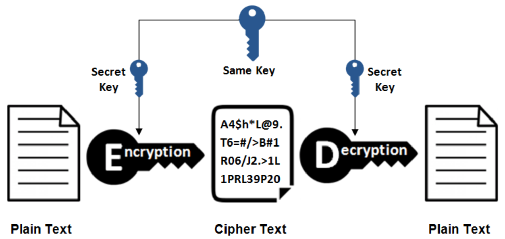
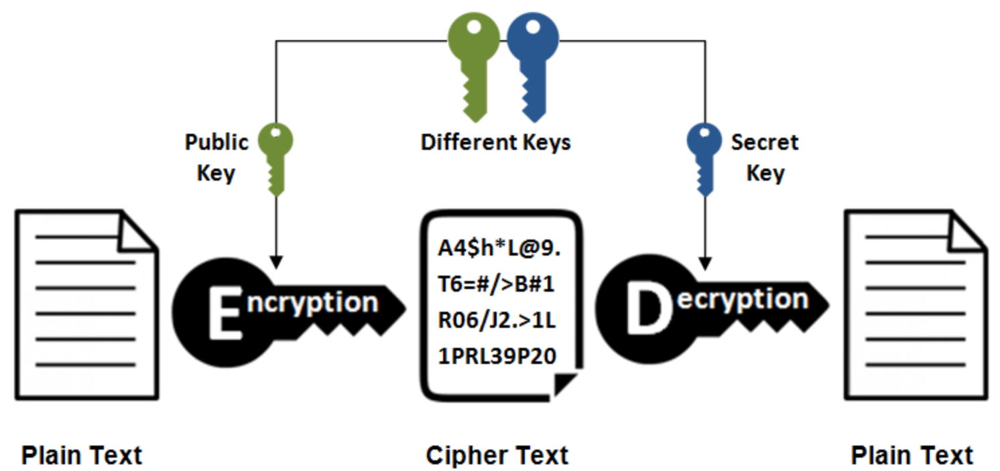
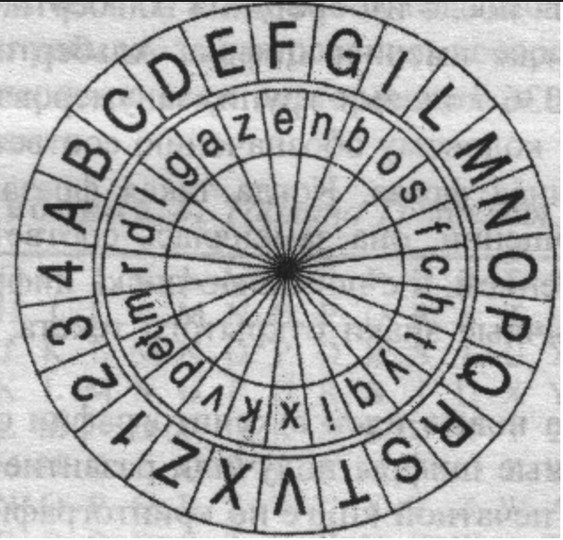
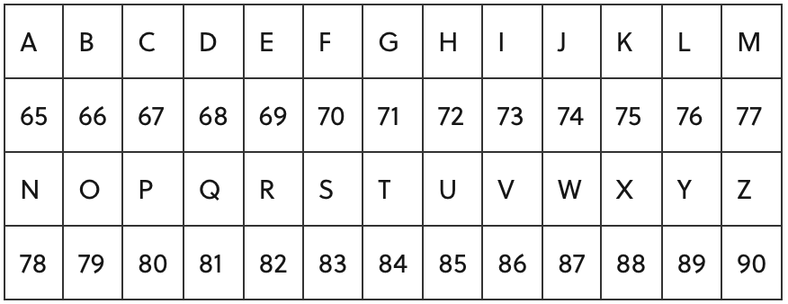

# Cryptography

Confidentiality, integrity and availability are the three basic components around which we should build and maintain our security model. Encryption is one of the tools we have available to achieve this and it can help us to make communications safer and ensure that only the sender and receiver can read clear text data.

## Cryptography Concepts

### Cryptography

Cryptography is the study of secure communications techniques that allow only the sender and intended recipient of a message to view its contents. The term is derived from the Greek word kryptos, which means hidden. It is closely associated to encryption, which is the act of scrambling ordinary text into what is known as ciphertext and then back again upon arrival. In addition, cryptography also covers the obfuscation of information in images using techniques such as microdots or merging. Ancient Egyptians were known to use these methods in complex hieroglyphics, and Roman Emperor Julius Caesar is credited with using one of the first modern cyphers.

The objective of cryptography is not only confidentiality, it also includes integrity, authentication and non-repudiation.

### Types of Cryptography

#### Symmetric Cryptography

Symmetric key algorithms are those which use a single set of keys for both encryption and decryption of data. This key is generally a shared secret between multiple parties who want to encrypt or decrypt the data.

Most widely used symmetric cyphers are AES and DES.

#### Asymetric Cryptography / Public Key Cryptography

Asymmetric cryptography, also known as public-key cryptography, is a process that uses a pair of related keys, one public key and one private key, to encrypt and decrypt a message and protect it from unauthorized access or use. A public key is a cryptographic key that can be used by any person to encrypt a message so that it can only be deciphered by the intended recipient with their private key. A private key, also known as a secret key, is shared only with key's initiator.

Many protocols rely on asymmetric cryptography, including the transport layer security (TLS) and secure sockets layer (SSL) protocols, which make HTTPS possible. The encryption process is also used in software programs such as browsers that need to establish a secure connection over an insecure network like the Internet or need to validate a digital signature.

RSA, DSA and Diffie-Hellman algorithm are popular examples of asynchronous cyphers.

Usually, private keys are known only by the owner and public keys are issued by using a Public Key Infrastructure (PKI) where a trusted Certification Authority certify the ownership of the key pairs.

### Government Access to Keys

By the Government Access to Keys (GAK) schema, software companies will give copies of all keys to the government and the government promises that they will hold on to the keys in a secure way, and will only use them when a court issues a warrant to do so.

## Encryption Algorithms

A cypher is a set of rules by which we implement encryption. Thousands of cyphers algorithms are available on the Internet. Some of them are proprietary while other s are open source. Common methods by which cyphers replace original data with encrypted data are:

### Substitution

The simple substitution cypher is a cypher that has been in use for many hundreds of years (an excellent history is given in Simon Singhs 'the Code Book'). It basically consists of substituting every plaintext character for a different ciphertext character. It differs from the Caesar cypher in that the cypher alphabet is not simply the alphabet shifted, it is completely jumbled.

The simple substitution cypher offers very little communication security, and it will be shown that it can be easily broken even by hand, especially as the messages become longer (more than several hundred ciphertext characters).

### Polyalphabetic

The development of Polyalphabetic Substitution Ciphers was the cryptographers answer to Frequency Analysis. The first known polyalphabetic cypher was the Alberti Cipher invented by Leon Battista Alberti in around 1467. He used a mixed alphabet to encrypt the plaintext, but at random points he would change to a different mixed alphabet, indicating the change with an uppercase letter in the ciphertext. In order to utilise this cypher, Alberti used a cypher disc to show how plaintext letters are related to ciphertext letters.

### Stream Cypher

A stream cypher is an encryption algorithm that encrypts 1 bit or byte of plaintext at a time. It uses an infinite stream of pseudorandom bits as the key. For a stream cypher implementation to remain secure, its pseudorandom generator should be unpredictable and the key should never be reused. Stream cyphers are designed to approximate an idealized cypher, known as the One-Time Pad.

The One-Time Pad, which is supposed to employ a purely random key, can potentially achieve "perfect secrecy". That is, it is supposed to be fully immune to brute force attacks. The problem with the one-time pad is that, in order to create such a cypher, its key should be as long or even longer than the plaintext.

#### Popular Stream Cyphers

* **RC4**: Rivest Cipher 4 (RC4) is the most widely used of all stream cyphers, particularly in software. It is also known as ARCFOUR or ARC4. RC4 steam cyphers have been used in various protocols like WEP and WPA (both security protocols for wireless networks) as well as in TLS. Unfortunately, recent studies have revealed vulnerabilities in RC4, prompting Mozilla and Microsoft to recommend that it be disabled where possible. In fact, RFC 7465 prohibits the use of RC4 in all versions of TLS. There are newer version RC5 and RC6.

### Block Cipher

A block cypher is an encryption algorithm that encrypts a fixed size of n-bits of data, known as a block, at one time. The usual sizes of each block are 64 bits, 128 bits, and 256 bits. So for example, a 64-bit block cypher will take in 64 bits of plaintext and encrypt it into 64 bits of ciphertext. In cases where bits of plaintext is shorter than the block size, padding schemes are called into play. Majority of the symmetric cyphers used today are actually block cyphers. DES, Triple DES, AES, IDEA, and Blowfish are some of the commonly used encryption algorithms that fall under this group.

#### Popular Block Cyphers

* **DES**: Data Encryption Standard (DES) used to be the most popular block cypher in the world and was used in several industries. It is still popular today, but only because it is usually included in historical discussions of encryption algorithms. The DES algorithm became a standard in the US in 1977. However, it is already been proven to be vulnerable to brute force attacks and other cryptanalytic methods. DES is a 64-bit cypher that works with a 64-bit key. Actually, 8 of the 64 bits in the key are parity bits, so the key size is technically 56 bits long.

* **3DES**: As its name implies, 3DES is a cypher based on DES. It is practically DES that is run three times. Each DES operation can use a different key, with each key being 56 bits long. Like DES, 3DES has a block size of 64 bits. Although 3DES is many times stronger than DES, it is also much slower (about 3x slower). Because many organizations found 3DES to be too slow for many applications, it never became the ultimate successor of DES.

* **AES**: A US Federal Government standard since 2002, AES or Advanced Encryption Standard is arguably the most widely used block cypher in the world. It has a block size of 128 bits and supports three possible key sizes: 128, 192, and 256 bits. The longer the key size, the stronger the encryption. However, longer keys also result in longer processes of encryption.

* **Blowfish**: This is another popular block cypher (although not as widely used as AES). It has a block size of 64 bits and supports a variable-length key that can range from 32 to 448 bits. One thing that makes blowfish so appealing is that Blowfish is unpatented and royalty-free. 

* **Twofish**: This cypher is related to Blowfish but it is not as popular. It is a 128-bit block cypher that supports key sizes up to 256 bits long.

### DSA and Related Signature Schemes

The DSA algorithm works in the framework of public-key cryptosystems and is based on the algebraic properties of modular exponentiation, together with the discrete logarithm problem, which is considered to be computationally intractable. The algorithm uses a key pair consisting of a public key and a private key. The private key is used to generate a digital signature for a message, and such a signature can be verified by using the signer's corresponding public key. The digital signature provides message authentication (the receiver can verify the origin of the message), integrity (the receiver can verify that the message has not been modified since it was signed) and non-repudiation (the sender cannot falsely claim that they have not signed the message).

A digital certificate contains various items that are:

* **Subject**: Certificate's holder name.

* **Serial Number**: Unique number to identify the certificate.

* **Public key**: A public copy of the public key of the certificate holder.

* **Issuer**: Certificate issuing authority's digital signature to verify that the certificate is real.

* **Signature algorithm**: Algorithm used to digitally sign a certificate by the Certification Authority (CA).

* **Validity**: Validity of a certificate mark by expiration date and time.

### RSA

RSA is an encryption algorithm, used to securely transmit messages over the internet. It is based on the principle that it is easy to multiply large numbers, but factoring large numbers is very difficult. For example, it is easy to check that 31 and 37 multiply to 1147, but trying to find the factors of 1147 is a much longer process.

RSA is an example of public-key cryptography, which is illustrated by the following example: Suppose Alice wishes to send Bob a valuable diamond, but the jewel will be stolen if sent unsecured. Both Alice and Bob have a variety of padlocks, but they don't own the same ones, meaning that their keys cannot open the other's locks.

In RSA, the public key is generated by multiplying two large prime numbers _p_ and _q_ together, and the private key is generated through a different process involving _p_ and _q_. A user can then distribute his public key _pq_, and anyone wishing to send the user a message would encrypt their message using the public key. For all practical purposes, even computers cannot factor large numbers into the product of two primes, in the same way that factoring a number like 414863 by hand is virtually impossible.

The implementation of RSA makes heavy use of modular arithmetic, Euler's theorem, and Euler's totient function. Notice that each step of the algorithm only involves multiplication, so it is easy for a computer to perform:

1. First, the receiver chooses two large prime numbers _p_ and _q_. Their product, _n = pq_, will be half of the public key.

2. The receiver calculates _ϕ(pq) = (p−1)(q−1)_ and chooses a number _e_ relatively prime to _ϕ(pq)_. In practice, _e_ is often chosen to be _(2^16) + 1 = 65537_, though it can be as small as _3_ in some cases. _e_ will be the other half of the public key.

3. The receiver calculates the modular inverse _d_ of _e_ modulo _ϕ(n)_. In other words, _de ≡ 1(modϕ(n))_. _d_ is the private key.

4. The receiver distributes both parts of the public key: _n_ and _e_. _d_ is kept secret.

Now that the public and private keys have been generated, they can be reused as often as wanted. To transmit a message, follow these steps:

1. First, the sender converts his message into a number _m_. One common conversion process uses the ASCII alphabet:

For example, the message "HELLO" would be encoded as 7269767679. It is important that _m<n_, as otherwise the message will be lost when taken modulo _n_, so if _n_ is smaller than the message, it will be sent in pieces.

2. The sender then calculates _c ≡ m^e (mod n)_. _c_ is the ciphertext, or the encrypted message. Besides the public key, this is the only information an attacker will be able to steal.

3. The receiver computes _c^d ≡ m(modn)_, thus retrieving the original number _m_.

4. The receiver translates _m_ back into letters, retrieving the original message.

_Note that step 3 makes use of Euler's theorem._

### Message Digest (One-Way Hash) Functions

A message digest is a cryptographic hash function containing a string of digits created by a one-way hashing formula.

Message digests are designed to protect the integrity of a piece of data or media to detect changes and alterations to any part of a message. They are a type of cryptography utilizing hash values that can warn the copyright owner of any modifications applied to their work.

Message digest hash numbers represent specific files containing the protected works. One message digest is assigned to particular data content. It can reference a change made deliberately or accidentally, but it prompts the owner to identify the modification as well as the individual(s) making the change. Message digests are algorithmic numbers.

This term is also known as a hash value and sometimes as a checksum.

The message digest is a unique fixed-size bit string that is calculated in a way that if a single bit is modified, it will change fifty per cent of the message digest value.

#### Message Digest Function (MD5)

The MD5 function is a cryptographic algorithm that takes an input of arbitrary length and produces a message digest that is 128 bits long. The digest is sometimes also called the "hash" or "fingerprint" of the input. MD5 is used in many situations where a potentially long message needs to be processed and/or compared quickly. The most common application is the creation and verification of digital signatures.

MD5 was designed by well-known cryptographer Ronald Rivest in 1991. In 2004, some serious flaws were found in MD5. The complete implications of these flaws has yet to be determined.

#### Secure Hashing Algorithm (SHA)

Secure Hash Algorithms (SHA) are a family of cryptographic functions designed to keep data secured. It works by transforming the data using a hash function: an algorithm that consists of bitwise operations, modular additions, and compression functions. The hash function then produces a fixed-size string that looks nothing like the original. These algorithms are designed to be one-way functions, meaning that once they’re transformed into their respective hash values, it is virtually impossible to transform them back into the original data. A few algorithms of interest are SHA-1, SHA-2, and SHA-3, each of which was successively designed with increasingly stronger encryption in response to hacker attacks. SHA-0, for instance, is now obsolete due to the widely exposed vulnerabilities.

SHA-1 produce 160-bits hashing values. SHA-2 is a group of different hashing including SHA-256, SHA-384 and SHA-512

#### Hashed Message Authentication Code (HMAC)

A hashed message authentication code (HMAC) is a message authentication code that makes use of a cryptographic key along with a hash function. The actual algorithm behind a hashed message authentication code is complicated, with hashing being performed twice. This helps in resisting some forms of cryptographic analysis. A hashed message authentication code is considered to be more secure than other similar message authentication codes, as the data transmitted and key used in the process are hashed separately.

### Secure Shell (SSH)

Secure Shell (SSH) is a cryptographic network protocol for operating network services securely over an unsecured network. Typical applications include remote command-line, login, and remote command execution, but any network service can be secured with SSH.

SSH provides a secure channel over an unsecured network by using client-server architecture, connecting an SSH client application with an SSH server. The protocol specification distinguishes between two major versions, referred to as SSH-1 and SSH-2. The standard TCP port for SSH is 22.

Secure shell protocol consist of three major components:

* The Transport Layer Protocol (SSH-TRANS) provides server authentication, confidentiality and integrity. It may optionally also provide compression. The transport layer will typically run over a TCP/IP connection, but might also run of any other reliable data stream.

* The User Authentication Protocol (SSH-USERAUTH) authenticates the client-side user to the server. It runs over the transport layer protocol.

* The Connection Protocol (SSH-CONNECT) multiplexes the encrypted tunnel into several logical channels. It runs over the user authentication protocol.

## Cryptography Tools
