# CEH v10 - Certified Ethical Hacker

## 0. Disclaimer

This disclaimer is mainly designed to cover the content explained in this document Ethical Hacking.

> Any actions and or activities related to the material contained within this document is solely your responsibility. The misuse of the information in this document can result in criminal charges brought against the persons in question. The author will not be held responsible in the event any criminal charges be brought against any individuals misusing the information in this document to break the law.

> This document contains materials that can be potentially damaging or dangerous. If you do not fully understand something on this document, then do not use it or ask for proper advice! Refer to the laws in your province/country before accessing, using, or in any other way utilizing these materials. These materials are for educational and research purposes only. Do not attempt to violate the law with anything contained here. Neither the author of this material or anyone else affiliated in any way is going to accept responsibility for your actions.

> Any linked sites are not under the control of the author and the author is not responsible for the contents of any linked site or any link contained in a linked site, or any changes or updates to such sites. I am providing these links to you only as a convenience, and the inclusion of any link does not imply endorsement by me.

> The intention of the document is to provide a free, safe and legal training to the readers, for this reason, a user terms and services agreement has been set in place.

> Your usage of this document constitutes your agreement to the following terms.

> 1. All the information provided on this document is for educational purposes only. The document is no way responsible for any misuse of the information.

> 2. This document is related to Computer Security and not a site that promotes hacking /cracking/software piracy.

> 3. This document is meant for providing information on “Computer Security” and other related topics and is no way related to the terms “CRACKING” or “HACKING” (Unethical).

> 4. Few parts on this document may contain the information related to “Hacking Passwords” or “Hacking Email Accounts” (Or Similar terms). These are not the GUIDES of Hacking. They only provide information about the legal ways of retrieving the passwords. You shall not misuse the information to gain unauthorised access. However, you may try out these hacks on your computer at your own risk. Performing hack attempts (without permission) on computers that you do not own is illegal.

> 5. Any of the virus creation parts on this document provide a demonstration on coding simple viruses using high-level programming languages. These viruses are simple ones and cause no serious damage to the computer. However, I strongly insist that this information shall only be used to expand programming knowledge and not for causing malicious attacks.

> 6. All the information on this document is meant for developing Hacker Defense attitude among the users and help to prevent the hack attacks. I insist that this information shall not be used for causing any kind of damage directly or indirectly. However, you may try these codes on your computer at your own risk.

> 7. The word “Hack” or “Hacking” that is used on this site shall be regarded as “Ethical Hack” or “Ethical Hacking” respectively.

> 8. I am in favour of exploration, learning and testing always inside the law and I condemn any actions outside the law.

> 9. Some of the tricks provided by me may no longer work due to fixture in the bugs that enabled the exploits. I am not responsible for any direct or indirect damage caused due to the usage of the hacks provided on this site.

> 10. The document holds no responsibility for the contents found in the user comments since I do not monitor them. However, I may remove any sensitive information present in the user comments upon request.

> 11. I reserve the right to modify the Disclaimer at any time without notice.

> 12. I am not the vendors of any products (software, books etc.) that I recommend on this document. Hence I do not have any liability related to the products recommend by me. It is the responsibility of the buyers to contact the respective vendors for any queries related to the products.

## 1. Introduction to Ethical Hacking

TODO - Give an introduction and list the phase of an ethical hacking test. Some terminology and concepts. Maybe some description of security risks. TBD

## 2. Footprinting & Reconnaissance

The footprinting phase allows an attacker to gather information regarding internal and external security architectures. The collection of information also helps to:

* Identify possible vulnerabilities within a system.
* Reduce the focus of the attack.
* Discover obvious and non-obvious resources available.
* Identify possible vulnerabilities.
* Draw a network map.

This is the first phase of an ethical hacking test. The person performing the test is going to gather as much information as possible regarding the target or its infrastructure.

Possible sources of information or techniques can be:

* Publicly available information like social networks, newspapers or enterprise online resources like webpages.
* Employees' social and or professional networks.
* Social engineering.
* Search engines.
* WHOIS and DNS registers.
* Competitive intelligence.
* Google hacking techniques.
* Emails.

The overall objective of this phase is to keep the interaction with the target at minimum levels and gathering information without any detection or alerting.

A step by step methodology can be:

1. Authorisation and scope definition of the assessment.
2. Footprinting using search engines.
3. Google hacking.
4. Footprinting using social network sites.
5. Website footprinting.
6. Email footprinting.
7. Competitive intelligence.
8. WHOIS footprinting.
9. Network footprinting.
10. Social engineering.
11. Document all findings.

### Footprinting Using Search Engines

Search engines are an amazing tool to find information about a target and, also, they allow to gather this information without having real contact with the target. Pages like Google or Bing allow to search for any information and find and collect it from every available place on the Internet. Information like office addresses, founders, employee names, employee information, partners, competitors, websites and much more. Also, sometimes a good resource is the cache information these search engines store.

Once we have found the official websites, we can explore them to obtain multiple good information accessing the public parts of the webpages. But, we can explore the restricted parts of the webpages, this can be done by trial error or using available tools for this purpose like [Netcraft - Search Web by Domain](https://searchdns.netcraft.com). Another interesting tool they offer is the [Netcraft - Site report](https://sitereport.netcraft.com).

Let's see an example. We are going to use the [Tesla](https://www.tesla.com) because they have a [bug bounty program](https://www.tesla.com/about/security).

If we execute the Search Web by Domain tool, we can see the next result:

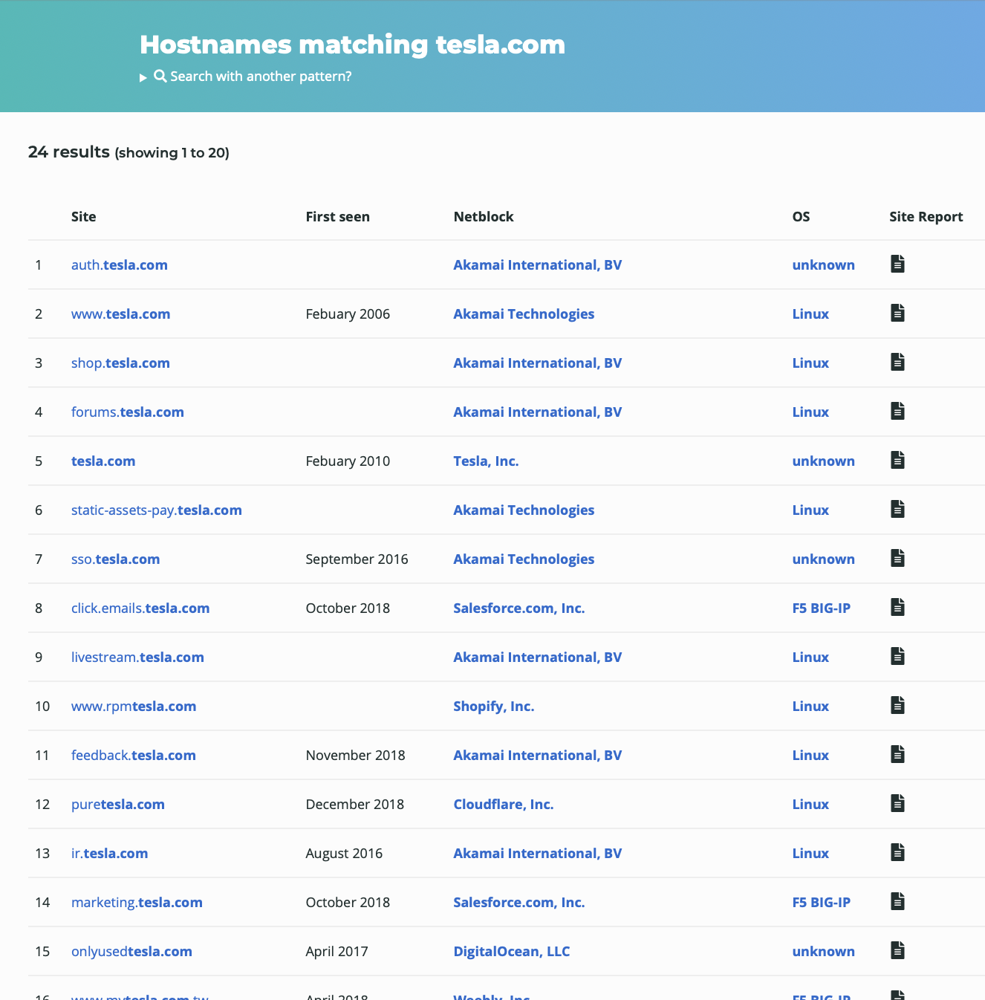

Another very interesting tool is worth it to mention is [Shodan](https://www.shodan.io). As they describe themselves, Shodan is the world's first search engine for Internet-connected devices. It can give infrastructure information, even available ports, a lot of very useful information.

### Collecting Location Information

Obvious tools to find information about a company and its surrounding without the need to go to their location or locations are map tools like [Google Maps](https://www.google.com/maps) or [Bing Maps](https://www.bing.com/maps). But, in general, any other map or location service it will do it.

The reason to do this is not just in case a physical test needs to be done, all the gathered information about the surrounding can be used for social engineering attacks.

### People Search Online Services

As has been mentioned before, the more information it is gathered the better. Part of this important information is the one around employees of a company. Nowadays, multiple online services are offering the possibility of identifying phone numbers, address and people.

Some of them are paid services but with a few searches, free ones can be found.

### Gather Information from Financial Services

Some search engines can provide financial information about a target. And not just its financial information, they can provide a list of competitors and or some information about its competitors.

* [Google Finance](https://www.google.com/finance)
* [Yahoo Finance](https://finance.yahoo.com)

### Job Sites

Job sites can be a true gold mine, they are going to offer us not only information about employees, positions, curriculums and relations but, if close attention is paid to the job descriptions and or job offers, a huge amount of information can also be gathered i.e. departments,  technologies or software.

A different approach can be followed creating, for example, a fake job position to target a specific person and collect their personal information.

* [Linkedin](https://www.linkedin.com)
* [Monster](https://www.monster.co.uk)

### Monitoring Targets Using Alerts

Same services names in the above paragraphs can be used to set alerts or subscribe to feeds about a target to receive the latest update and information about it.

* [Google Alerts](https://www.google.co.uk/alerts)

### Information Gathering Using Groups, Forums and Blogs

All these elements can leak sensitive information and it can allow attackers with a fake profile to reach and interact with the companies and or the people working there, it does not matter if there are official or non-official channels, information can be leaked in either.

### Google Advanced Search (Google Hacking)

Everyone knows the Google search engine, everyone uses it and know its basic functionality but, what not everyone knows, it is that the search engine offers some specific operators that can help to refine and focus the search operations, making the results more relevant. Some of the operators are:

* `site:`: Search for the results in a given domain.
* `related:`: Search for similar websites.
* `cache:`: Display the webpages stored in the cache.
* `link:`: Link all the websites having a link to a specific website.
* `allintext:`: Search for websites containing a specific keyword.
* `intext:`: Search for documents containing a specific keyword.
* `allintitle:`: Search for websites containing a specific keyword in the title.
* `intitle:`: Search for documents containing a specific keyword in the title.
* `allinurl:`: Search for websites containing a specific keyword in the URL.
* `inurl:`: Search for documents containing a specific keyword in the URL.

If we do not like to type all these operators, we can use the [Google Advanced Search Webpage](https://www.google.com/advanced_search).

### Google Hacking Database (GHDB)

Google Hacking or Google Dorking is a combination of hacking techniques that allow finding security holes within an organisation's network and systems using the Google search engine and or other applications powered by Google. Whit endless combinations of operators and endless use cases a database categorising possible queries has been created and, it is well known as [GHDB](https://www.exploit-db.com/google-hacking-database).

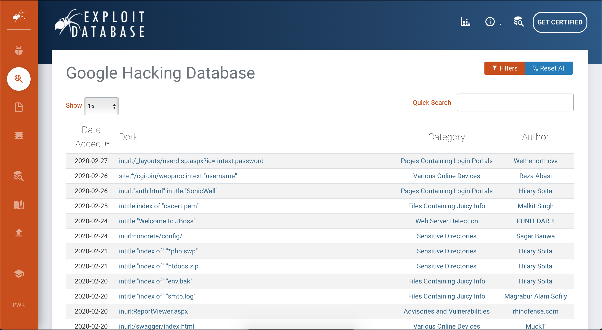

### Social Networking Sites

In the old days, attackers needed to be creative to obtain people information, nowadays, people just throw their information online and an attacker just needs to go there to collect it. The places where the information and the attackers meet are social networks. There are tons of useful information waiting to be collected that can easily be used to focus attacks or social engineering attacks.

Some of the information that can be found in social networks can correlate to the information an attacker is looking for:

| Social network user action | Information |
|:-|:-|
| People maintain their profile | Photo of the target |
| | Contact numbers |
| | Email addresses |
| | Date of birthday |
| | Location |
| | Work details |
| People update their status | Most recent personal information |
| | Most recent location |
| | Family and friends information |
| | Activities and interests |
| | Technology-related information |
| | Upcoming events information |

### Website Footprinting

#### Web Application Security Scanners

Here, it is included the monitorisation and investigation of the target organisation websites. Attackers will try to obtain information like software running and their versions, operative systems, folder structures, databases information and, in general, any information that will be able to leverage in the next steps of the attack.

Before, we have named the Netcraft tool but, there are other tools it can be used for these purposes. Here, just a couple of examples:

* [Burp Suite](https://portswigger.net/burp): It is an open-source web application security scanner.
* [Zaproxy](https://www.zaproxy.org): It is a graphical tool for testing Web application security. It intends to provide a comprehensive solution for web application security checks.

As an example of how to use Burp Suite, we can check this video. As per the video description:

> This burp suite guide will help you get your software setup and teach you a methodology that will lead you to success. Hacking tools are powerful but you must know how to properly use them to their full potential. Learn how to setup burp proxies and scanners, fuzzing, how to use Burp Intruder, what to target in a bounty's scope, and more.

#### Detecting the OS

Some of the tools that have been already named as Netcraft and Shodan can be used to resolve this information with a simple query using their search engines.

Worth saying that, if the only thing we want to find is a specific connected device such as routers, servers, IoT or other devices, this can be done using the Shodan search engine and its variety of filters.

For example, a simple search of `D-Link` offers a long list of this kind of devices.

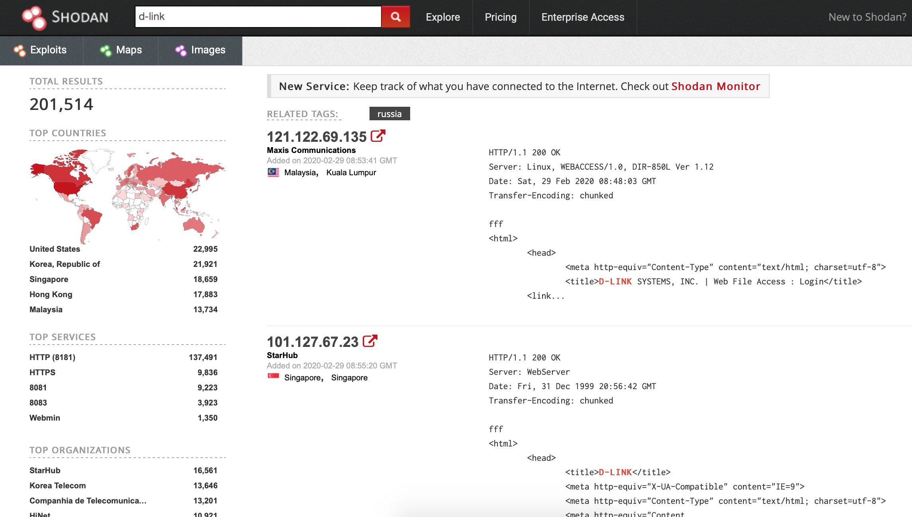

#### Web Spiders or Web Crawlers

Web spiders or web crawlers are automatic tools that surf and collect information from the Internet. They usually target a website and extract specific information like names, email addresses or any other information of this type.

Nowadays, the business of Risk Management and Thread Intelligence is growing and companies in this space design the crawler to cover forums, leak information pages and communities, code repositories and much more. If it is out there, it can be crawled. But, any search engines crawl the Internet trying to index it.

A good definition of what they are can be found [here](https://www.cloudflare.com/learning/bots/what-is-a-web-crawler/).

There are a lot of options and even with a few lines of code, a basic one can be built. Different attackers can have different favourite ones or even the combination of multiple to fit their needs. A good exercise having some programming background is to take a look at the source code of a simple one.

#### Mirroring a Website

One option is to completely download a website for offline analysis, allowing attackers to analysis in an online environment the source code of a website and its structure.

As in the previous case, there are a lot of options available with their pros and cons. Sometimes, one does the jobs, sometimes a combination of them is needed. Depends on personal preferences and use cases. some examples are:

* [Octoparse](https://www.octoparse.com/)
* [HTTrack](https://www.httrack.com/)
* [Cyotek WebCopy ](https://www.cyotek.com/cyotek-webcopy)
* [Getleft](https://sourceforge.net/projects/getleftdown/)
* [GNU Wget](https://www.gnu.org/software/wget/)

#### Web History

Attackers can check how corporative webpages have changed trying to find some extra information. The page [Wayback Machine](http://web.archive.org) offers the possibility of, given a webpage domain, browse across its modifications and different versions. It is truly a curious exercise.

#### Monitoring Web Updates

When an attacker is planning to target a company is sometimes interesting to keep an eye on the changes they do to their websites. To do this manually is a tedious and not rewarding task, for this reason, there are some content monitoring tools. They help you track and monitor changes on any website under consideration so you can take immediate actions as you like.

Some examples are:

* [Wachete](https://www.wachete.com/)
* [OnWebChange](https://onwebchange.com/)
* [ChangeTower](https://changetower.com/)
* [Visualping](https://visualping.io/)
* [Versionista](https://versionista.com/)

Again, there are multiple services and tools and attackers find the one that fits better to their purposes.

#### Email Footprinting

All business nowadays do extensive use of electronic communications, especially email communications, internally and externally. They contain tons of information, about the company i.e. financial information or technical information.

Also, to all the information the body of the emails can give to an attacker, tracking the email communications can be very useful. The information listed below can be obtained using tracking tools:

* Destination address.
* Sender's IP address.
* Sender's mail server.
* Time and date information.
* Authentication system information of sender's mail server.

Tools like [PoliteMail](https://politemail.com) can help attackers to track Outlook messages. As we can see, not all the named tools are designed for hacking purposes but, the truth is that legitimate tools can be used for illegitimate purposes.

Another interesting information that an attacker can find on email is the headers. Email headers can be explored manually but, some tools help attackers to trace hop by hop email communications and recover IP addresses.

#### Competitive Intelligence

At this point attackers are going to gather information and reports about the target competitors, they include legal news, press releases, financial information, analysis reports, and upcoming projects and plans. Attackers can identify:

* When did the company begin?
* Evolution of the company.
* Authority of the company.
* Background of an organisation.
* Strategies and planning.
* Financial statistics.
* Other information.

#### Monitoring Website Traffic

Ranking of the target's website, geographical view of the users, number of total and segmented users, daily statistics, and much more are just a few examples of information that can be obtained. Some services can help us with this:

* [Alexa](https://www.alexa.com/siteinfo)
* [monitis](https://www.monitis.com)

an example of what Alexa offers is:

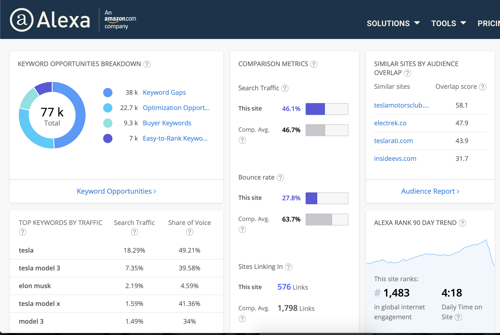

#### Tracking Online Reputation

Organisation's reputation can be tracked too using online reputation management tools (ORM). These tools are used to track reputation and rankings. It allows the attacker to study consumer opinions about target brands.

One example of these tools can be [WhosTalking](https://www.whostalkinseo.com).

#### Whois Footprinting

WHOIS is a query and response protocol that is widely used for querying databases that store the registered users or assignees of an Internet resource, such as a domain name, an IP address block or an autonomous system. WHOIS lookups can help attackers to find out who is behind the target domain. WHOIS is maintained by the organisation Regional Internet Registries (RIR). All the registrations are divided into five regions:

| RIR | Acronym | Locations |
| :- | :- | :- |
| African Network Information Centre | AFRINIC | Africa |
| American Registry for Internet Numbers | ARIN |  Antarctica, Canada, parts of the Caribbean, and the United States |
| Asia-Pacific Network Information Centre | APNIC |  East Asia, Oceania, South Asia, and Southeast Asia |
| Latin American and Caribbean Network Information Centre | LACNIC | Most of the Caribbean and all of Latin America |
| Réseaux IP Européens Network Coordination Centre | RIPE NCC |  Europe, Central Asia, Russia, and West Asia |

Lookups offer complete domain registration information like:

* Registrant information
* Registrant organisation
* Registrant country
* Domain name server information
* IP address
* IP location
* ASN (Autonomous System Number)
* Domain status
* WHOIS history
* IP history
* Registrar history
* Hosting history
* Email and postal address of the registrar and admin
* Contact details

There are plenty of WHOIS tools. As examples, an online one and the most common one, installed in almost any system, are going to be shown.

* [Whois Domaintools](http://whois.domaintools.com) (_online_)

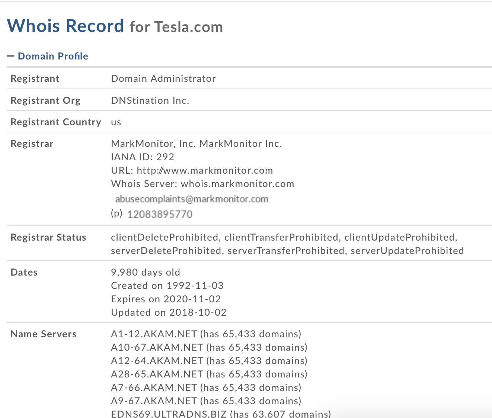

* `whois` command. (_offline_)

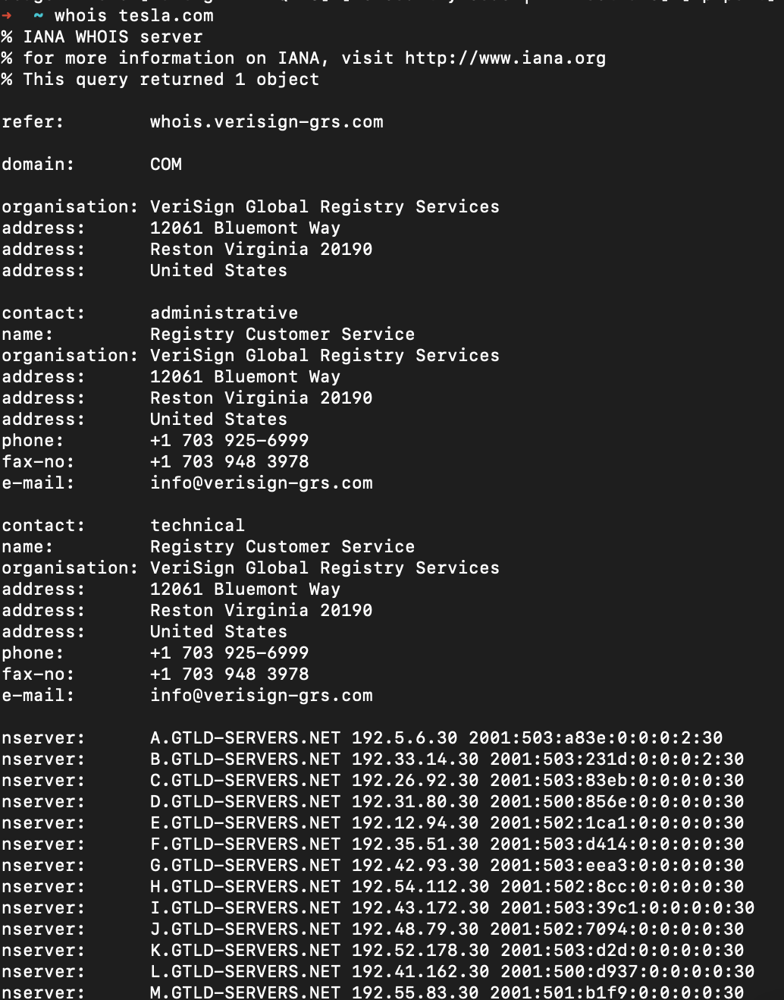

#### DNS Footprinting

[Domain Name System](https://en.wikipedia.org/wiki/Domain_Name_System) (DNS) is a hierarchical and decentralized naming system for computers, services, or other resources connected to the Internet or a private network. It associates various information with domain names assigned to each of the participating entities. Most prominently, it translates more readily memorized domain names to the numerical IP addresses needed for locating and identifying computer services and devices with the underlying network protocols.

Several records can be created associated with a DNS entry:

* **A Record**: An A record (Address Record) points a domain or subdomain to an IP address. i.e. `google.co.uk -> 172.217.20.131`.
* **CNAME**: A CNAME (Canonical Name) points one domain or subdomain to another domain name, allowing you to update one A Record each time you make a change, regardless of how many Host Records need to resolve to that IP address. i.e. `imap.example.org -> mail.example.org`.
* **MX Entry**: An MX Entry (Mail Exchanger) directs email to a particular mail server. Like a CNAME, MX Entries must point to a domain and never point directly to an IP address.
* **TXT Record**: A text record was originally intended for human-readable text. These records are dynamic and can be used for several purposes.
* **SRV Record**: An SRV (Service) record points one domain to another domain name using a specific destination port. SRV records allow specific services, such as VOIP or IM, to be directed to a separate location.
* **AAAA Record**: The AAAA record is similar to the A record, but it allows you to point the domain to an Ipv6 address.
* **NS**: Host name server.
* **SDA**: Indicate authority for the domain.
* **PTR**: IP-Host mapping.
* **RP**: Responsible person.
* **HINFO**: Host information.

Similar to what happened with the WHOIS tools, there are plenty of DNS lookup tools. As done before, an online one and a command one are going to be shown.

* [Dig (DNS lookup) - G Suite toolbox](https://toolbox.googleapps.com/apps/dig/) (_online_)

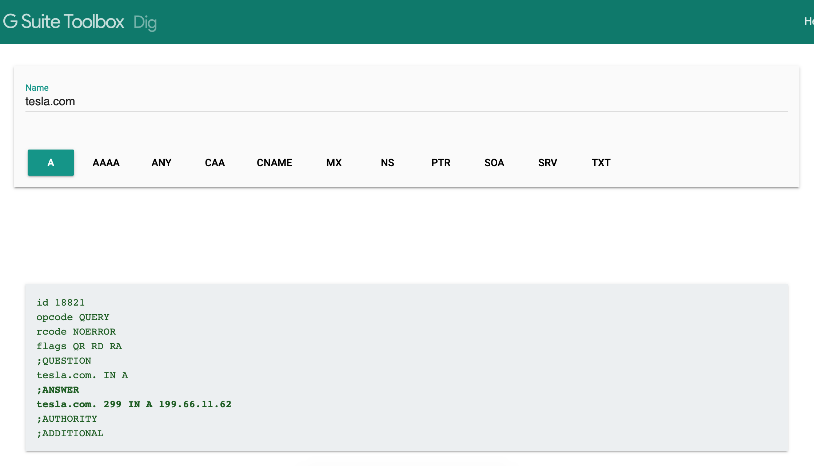

* `dig` command. (_offline_)

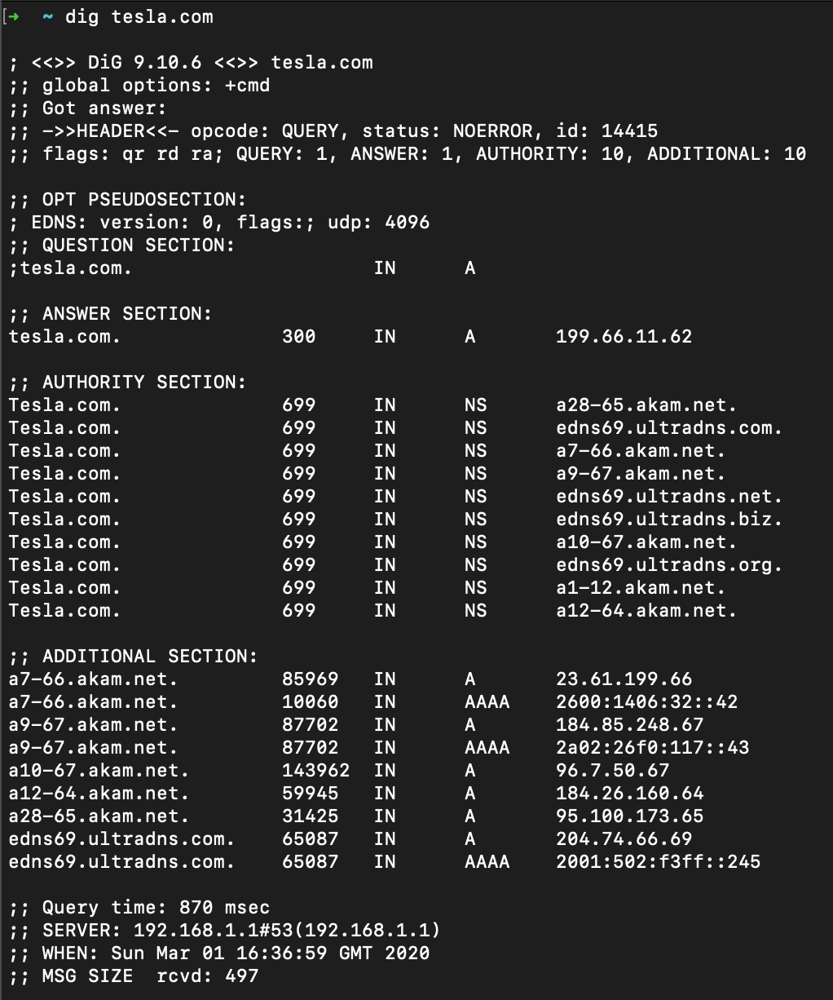

#### Network Footprinting

Attackers try to collect as much information as possible about the target system to find ways to penetrate the system and network footprinting is one of the most important parts of this process. Types of information we can find with network footprinting tools are:

* Network address ranges
* Hostnames
* Exposed hosts
* OS and application version information
* Path state of the host and the applications
* Structure of the application and back-end servers

Some tools attackers can use to achieve their goals are:

* WHOIS (already discussed)
* Ping
* Nslookup
* Tracert

As a probe of concept, the next image represents the execution of the `traceroute` command present in almost all systems. The image shows the path information between source and destination in the hop by hop manner, listing the hops and the latency between hops.

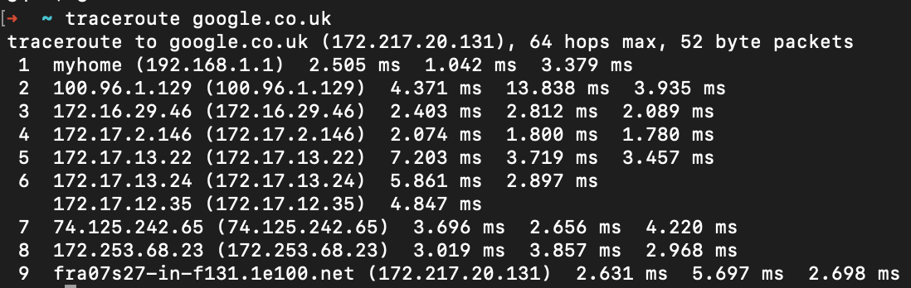

#### Footprinting through Social Engineering

Social engineering has been named a few times along this document but, it has not been properly defined. The Social engineering term refers to a technique of psychological manipulation to gather information from different social interactions online or offline. And, it has proven to be an invaluable source of information. In the end, it what is said, the human is, sometimes, the weakest link in the security chain.

There is almost an infinite number of social engineering techniques and, after a few conversations with social engineers, it is easy to realise that every single one of them has its style adapted to their interpersonal skills. Despite this, there are a few basic techniques it can be listed:

* Eavesdropping: Eavesdropping is the act of secretly or stealthily listening to the private conversation or communications of others without their consent. Listening conversation includes listening, reading or accessing any source of information without being notified. The practice is widely regarded as unethical, and in many jurisdictions is illegal.
* Shoulder surfing: Taking this literally, it is gathering information by standing behind the targets when they are interacting with sensitive information. It is used to obtain information such as personal identification numbers (PINs), passwords and other confidential data, for example, the keystrokes on a device or sensitive information in the screen.
* Dumpster diving: It is salvaging from large commercial, residential, industrial and construction containers for unused items discarded by their owners, but deemed useful to the picker.
* Impersonation:  Impersonation differs from other forms of social engineering because it occurs in person, rather than over the phone or through email. The social engineer "impersonates" or plays the role of someone the targets are likely to trust or obey convincingly enough to fool them into allowing access to offices, to information, or systems. This type of social engineering plays on people natural tendencies to believe that people are who they say they are, and to follow instructions when asked by an authority figure. It involves the conscious manipulation of a victim to obtain information without the individual realizing that a security breach is occurring.
* Phishing: It is the fraudulent attempt to obtain sensitive information by disguising oneself as a trustworthy entity in an electronic communication. Typically carried out by email spoofing or instant messaging. It often directs users to enter personal information at a fake website which matches the look and feel of the legitimate site.

Some information attackers can obtain using social engineering are:

* Credit card information
* Usernames and passwords
* Security devices and technology information
* Operating systems information
* Software information
* Network information
* IP addresses and name server's information

##### Maltego

One very interesting tool is [Maltego](https://www.maltego.com). Maltego is an open-source intelligence and graphical link analysis tool for gathering and connecting information for investigative tasks. ​Using Maltego attackers can automate the process of gathering information from different data sources.

##### Recon-ng

[Recon-ng](https://github.com/lanmaster53/recon-ng) is a full-featured Web Reconnaissance framework written in Python. Complete with independent modules, database interaction, built-in convenience functions, interactive help, and command completion, Recon-ng provides a powerful environment in which open source web-based reconnaissance can be conducted quickly and thoroughly.

##### FOCA

[FOCA (Fingerprinting Organizations with Collected Archives)](https://github.com/ElevenPaths/FOCA) is a tool used mainly to find metadata and hidden information in the documents it scans. These documents may be on webpages and can be downloaded and analysed with FOCA.

##### Metasploit Framework

[Metasploit Framework](https://github.com/rapid7/metasploit-framework) is another impressive tool with multiple uses but, it can be used to scan and gather information about a target. The Pro version can be used to automatise some of the steps in the next phases of an attack but, the free version is more than enough for this phase. You can find a comparison of both versions [here](https://www.rapid7.com/products/metasploit/download/editions/)

// TODO: Find a good tutorial o produce something (video or text/images)

#### Countermeasures of Footprinting

Among all the policies that can be set in place to try to prevent footprinting probably the most important thing is to provide education, training and awareness to employees of an organisation. Without this, no matter how many polices or countermeasures companies set, network restrictions, good server configurations, double checks on reports, press releases, everything will in some point fail if organisation users are not properly trained.

## 3. Scanning Networks

At this point, attackers have collected enough information about the target to take the next step, network scanning. In this phase, attackers will try to obtain concrete network information about the target resources. Things like:

* Identify live hosts.
* Identify open and closed ports.
* Identify operating system information.
* Identity services running on a network.
* Identity running processes.
* Identify existing security devices.
* Identify system architecture.
* Identify running services.
* Identify vulnerabilities.

During this phase attackers will start to establish contact with the target resources and extract information from the responses, trying to gain more knowledge of the network architecture and possible attack vectors.

### Network theory

The [Internet Protocol](https://en.wikipedia.org/wiki/Internet_Protocol) (IP) is the principal communications protocol in the Internet protocol suite for relaying datagrams across network boundaries. Its routing function enables internetworking and essentially establishes the Internet.

IP has the task of delivering packets from the source host to the destination host solely based on the IP addresses in the packet headers. For this purpose, IP defines packet structures that encapsulate the data to be delivered. It also defines addressing methods that are used to label the datagram with source and destination information.

Two types of IP traffic can be found:

* TCP
* UDP

#### TCP

The [Transmission Control Protocol](https://en.wikipedia.org/wiki/Transmission_Control_Protocol) (TCP) is one of the main protocols of the Internet protocol suite. It originated in the initial network implementation in which it complemented the Internet Protocol (IP). Therefore, the entire suite is commonly referred to as TCP/IP. TCP provides reliable, ordered, and error-checked delivery of a stream of octets (bytes) between applications running on hosts communicating via an IP network. Major internet applications such as the World Wide Web, email, remote administration, and file transfer rely on TCP, which is part of the Transport Layer of the TCP/IP suite.

TCP is connection-oriented, and a connection between client and server is established (passive open) before data can be sent. Three-way handshake (active open), retransmission, and error-detection adds to reliability but lengthens latency. This handshake ensures a successful and reliable connection between to serves.

Here it is shown the format of the TCP header:

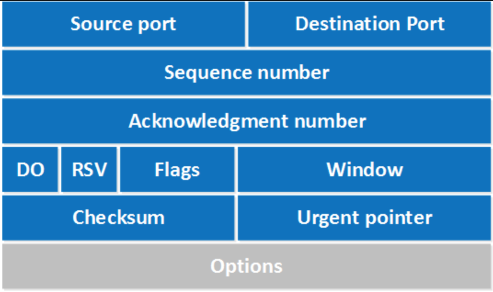

The field 'Flag' deserves a deeper analysis of the possible values that it can contain because some of the types of scanners we are going to see are closely related to them. We can find the next flag values:

| Flag | Use |
| :- | :- |
| SYN | Initiates a connection between to host to facilitate communication |
| ACK | Acknowledge the receipt of a packet |
| URG | Indicates that the data contained in the packet is urgent and should be processed immediately  |
| PSH | Instructs the sending system to send all buffered data immediately |
| FIN | Tells de remote system about the end of the communication, close the connection gracefully |
| RST | Reset a connection |

As named before, a TCP communication starts with a three-way handshake

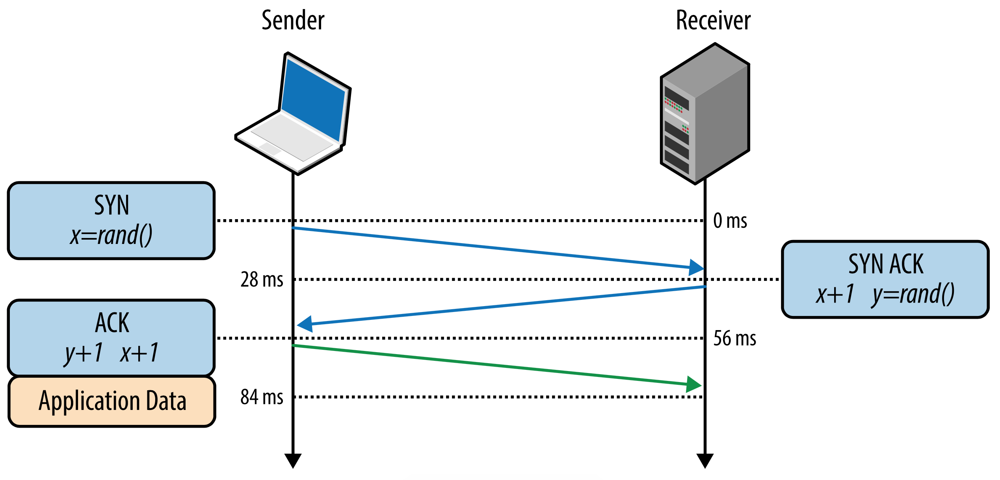

There are multiple network scanners that it will allow to use and send packets containing the different flags but, it is worth to say that there are some tools it can use to craft packets in a more manual way. [Python](https://www.python.org), for example, using the [Scrapy](https://scrapy.org) library gives versatility to create them programmatically and the tool [hping3](https://tools.kali.org/information-gathering/hping3) can help with it too. This will allow attackers a more fine control when testing a firewall or doing advanced port scanning. Also, some low point of view is always instructive

We can generate some packets with the flag SYN to do some port scanning:

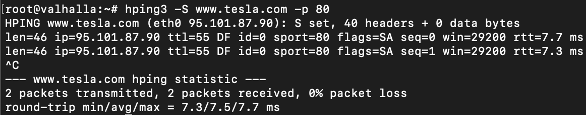

This test returns a SYN/ACK if the communication has been accepted or RST/ACK if the port is closed or filtered. In this case, the destination port of the packet is open.

Hping3 is a very versatile tool with multiple options.

#### UDP

The [User Datagram Protocol](https://en.wikipedia.org/wiki/User_Datagram_Protocol) (UDP) is one of the core members of the Internet protocol suite. The protocol was designed by David P. Reed in 1980 and formally defined in RFC 768. With UDP, computer applications can send messages, in this case, referred to as datagrams, to other hosts on an Internet Protocol (IP) network. Prior communications are not required to set up communication channels or data paths.

UDP uses a simple connectionless communication model with a minimum of protocol mechanisms. UDP provides checksums for data integrity, and port numbers for addressing different functions at the source and destination of the datagram. It has no handshaking dialogues, and thus exposes the user's program to any unreliability of the underlying network; there is no guarantee of delivery, ordering, or duplicate protection.

In the same way, TCP packets have been generated with hping3, UDP packets can be generated with hping3:

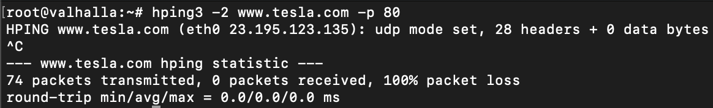

In this case, it is not possible to reach the server because the port 80 is using the TCP protocol.

### Scanning methodology

It is good for attackers to follow some kind of methodology or system to avoid missing something on their attempts. As said before, every attacker has its methodology (even if it is chaos), the steps shown here are just a suggestion:

* **Check for live systems**: Discovering which host are alive in the target's network. This can be done using [ICMP](https://en.wikipedia.org/wiki/Internet_Control_Message_Protocol) packets. The attacker sends an `ICMP Echo`and the server responds with an `ICMP Echo Reply` if it is alive. The tool `ping` is an example of this.

  * **ICMP scan**: Technique to identify live servers using ICMP packets.
  * **Ping sweep**: Technique to identify live server using ICMP packets at a large scale using IP ranges.

* **Discovering open ports**: Once attackers have a list of live servers they can try to discover what ports are open on them.
  * **SSDP scanning**: The [Simple Service Discovery Protocol](https://en.wikipedia.org/wiki/Simple_Service_Discovery_Protocol) (SSDP) is a network protocol based on the Internet protocol suite for advertisement and discovery of network services and presence information. It accomplishes this without the assistance of server-based configuration mechanisms, such as Dynamic Host Configuration Protocol (DHCP) or Domain Name System (DNS), and without special static configuration of a network host. SSDP is the basis of the discovery protocol of Universal Plug and Play (UPnP) and is intended for use in residential or small office environments.
  * **Scanning tools**: Port scan tools are widely spread. They give us multiple information about a live host and its ports.
    * **Nmap**: Without questions, the most well know is [Nmap](https://nmap.org). Nowadays, it is not just a port scanner, it can perform some other things but, here, the only interest is its scanning capabilities. Nmap can discover live hosts, open ports, services version and operative systems among other things.
    * **hping2 and hping3**: hping3 has been already named but, it has not been listed the things that can be done with it and its great capabilities to handcraft packets. Things like:
      * Test firewall rules
      * Advanced port scanning
      * Testing network performance
      * Path MTU discovery
      * Transfering rules between complex firewall rules
      * Traceroute-like under different protocols
      * Remote fingerprinting and others
  * **Scanning techniques**: There is a variety of different scanning techniques that attackers can use to gather the desired information:
    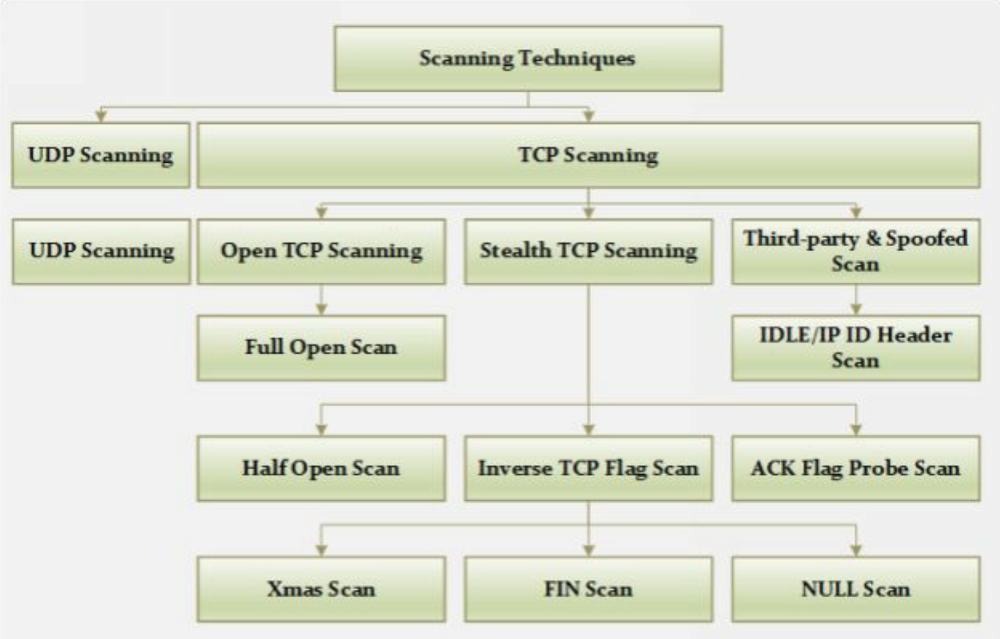
    * **Full Open Scan**: In this type of scanner the three-way handshake is initiated and completed. It is easy to detect and log by security devices. Does not require superuser privileges.
    * **Half Open Scan**: Also know as stealth scan, 
* **Scanning beyond IDS**: 
* **Banner grabbing**: 
* **Scanning vulnerabilities**: 
* **Network diagram**: 
* **Proxies**: 

## Information references

This text is a compilation of my thoughts, information that I have collected or learn reading, watching conferences or videos in the past and, obviously, some search over the Internet. For all the information extracted from different sources where someone else has done a good job explaining a concept, below it can be found a list of references:

* [Wikipedia](https://en.wikipedia.org/wiki/Main_Page)